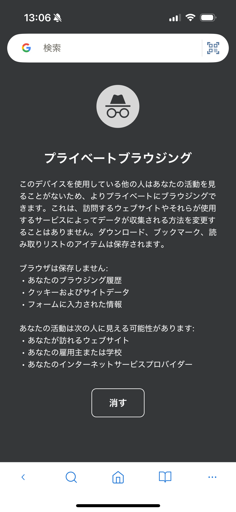

# プライベートモード

プライベートモードでは、閲覧履歴やCookieを通常のブラウジングデータとは分けて扱えます。この機能はiOS版で利用できます。

## プライベートブラウジングを始める

1. タブ一覧を開きます。
2. **プライベート**を選択します。
3. 新しいタブを開いて閲覧します。

> **重要:** プライベートモードは匿名化機能ではありません。アクセス先のWebサイト、勤務先や学校のネットワーク、インターネット接続事業者から通信を隠すものではありません。ダウンロードしたファイルや保存したブックマークは端末に残ります。

## 関連項目

- [ブラウジング履歴](browsing-history.md)
- [広告ブロック](ad-blocking.md)
