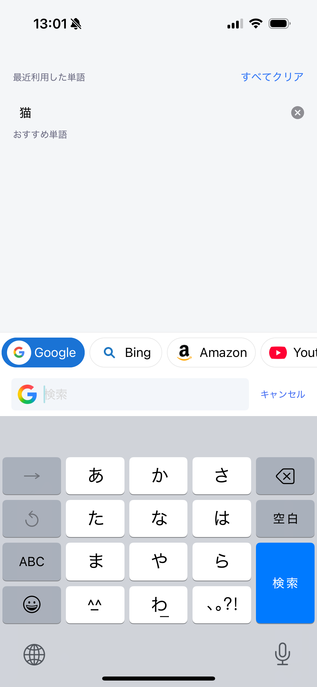

# 検索

アドレスバーにキーワードを入力してWebを検索できます。

## Webを検索する

1. アドレスバーをタップします。
2. キーワードを入力します。
3. 使用する検索サービスを選ぶか、キーボードの検索キーをタップします。

利用できる検索サービスは次のとおりです。

- Google
- Bing
- Amazon
- YouTube
- Twitter/X
- Wikipedia
- DeepL
- eBay

入力中は検索履歴も候補として表示されます。過去のキーワードをタップすると、同じ内容をすばやく検索できます。

## 関連項目

- [クイック検索](../../../home/i18n/ja/quick-search.md)
- [検索設定](../../../settings/i18n/ja/search.md)
