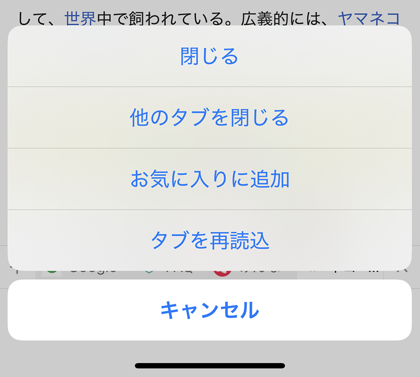
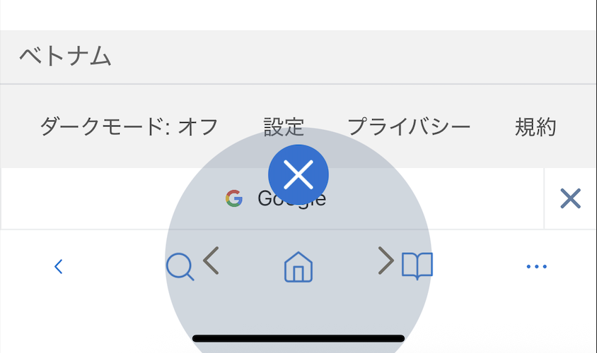

# タブ操作

複数のWebページをタブで開き、すばやく切り替えられます。

## タブを開く・切り替える

1. タブ一覧ボタンをタップします。
2. 新しいタブを開くか、表示するタブを選びます。

初期状態の最大タブ数は12です。**設定** > **タブ** > **最大タブ数**で変更できます。タブを多く開くと、端末のメモリ使用量や動作に影響する場合があります。

## タブのクイック操作

タブを約2秒間長押しすると、次の操作を選べます。

- タブを閉じる
- ほかのタブを閉じる
- ブックマークに追加する
- タブを再読み込みする

## ジェスチャー操作

ホームアイコンを長押ししたまま上・左・右へスワイプすると、**閉じる**、**戻る**、**進む**のクイック操作を実行できます。

## 表示を変更する

- タブの表示方式は、**設定** > **タブ**で変更できます。初期状態はスライド式のタブバーです。
- 下方向へスクロールしたときのアドレスバーとタブバーの表示は、**設定** > **ツールバーとタブバー**で変更できます。

## 関連項目

- [ブラウザツールメニュー](browser-tool-menu.md)
- [ブックマーク](bookmarks.md)
