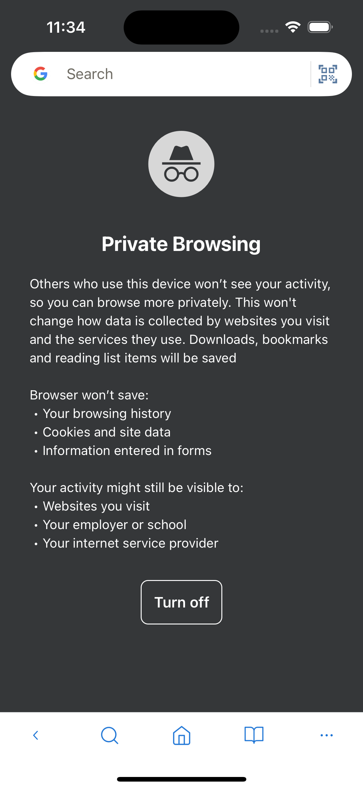

---
navigation:
  order: 1100
---

# Private Mode

Private Mode opens a separate browsing session without adding visited pages to normal history. This feature is available on iOS only.

## Start private browsing

1. Open **Private Browser** from the Home screen Tool Menu.
2. Browse or open tabs as usual.
3. Close Private Mode when you finish.

> **Important:** Private Mode reduces data stored by Lunascape, but it does not make you anonymous to websites, network operators, or internet providers. Downloads and files you explicitly save remain on the device.

## Related topics

- [Browsing History](browsing-history.md)
- [Privacy Settings](../settings/privacy.md)
