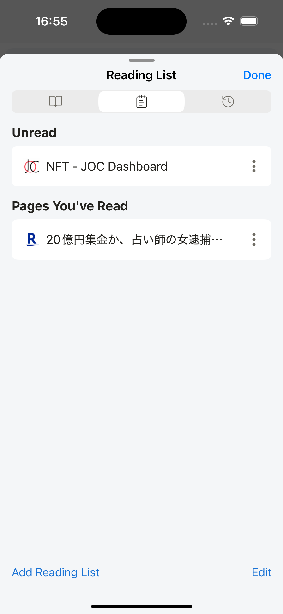

---
navigation:
  order: 500
---

# Reading List

The Reading List saves pages you want to return to and separates unread items from pages you have already opened.

## Add the current page

1. Open the page you want to save.
2. Open the Browser Tool Menu.
3. Select **Add to Reading List**.

## Read and manage saved pages

1. Open **Reading List** from the browser tools.
2. Select a page from **Unread** or **Pages You've Read**.
3. Delete entries you no longer need.

Reading List status is for organization only. Saving an item does not guarantee that the page is available offline.

## Related topics

- [Bookmarks](bookmarks.md)
- [Browser Tool Menu](browser-tool-menu.md)
