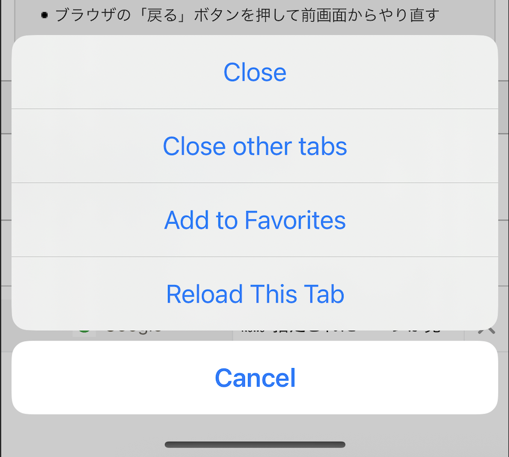

---
navigation:
  order: 700
---

# Tab Operations

Use tabs to keep multiple pages open and switch between them.

## Open and switch tabs

- Tap the new-tab control to open another tab.
- Tap a tab to switch to it.
- Close tabs you no longer need to reduce memory use.

The default maximum is 12 tabs. Change it from **Settings** > **General** > **Tab** > **Set Maximum Tab**. A large limit can reduce browsing performance.

## Use the tab quick-action menu

Touch and hold a tab for about two seconds. Depending on the current tab, the menu provides actions such as:

- **Close**
- **Close Other Tabs**
- **Add to Bookmark**
- **Reload This Tab**

## Use Home icon gestures

Touch and hold the Home icon, then swipe in the displayed direction to use a gesture action such as **Close**, **Back**, or **Forward**.

## Change tab appearance

- Change the tab mode from **Settings** > **General** > **Tab**.
- Change automatic toolbar and tab-bar hiding from **Settings** > **Display** > **Tool Bar & Tab Bar**.

## Related topics

- [General Settings](../settings/general.md#tabs)
- [Display Settings](../settings/display.md#toolbar-and-tab-bar)
