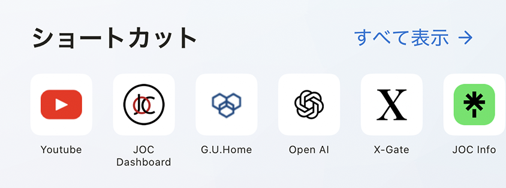

# ブラウザショートカット

ブラウザショートカットを使うと、よく利用するWebサイトをホーム画面から直接開けます。

## ショートカットを開く

1. ホーム画面でブラウザショートカットのウィジェットを探します。
2. ショートカットをタップしてWebサイトを開きます。

現在のタブと新しいタブのどちらで開くかは、**設定** > **一般** > **ショートカットを新しいタブで開く**で変更できます。

## ショートカットを追加・整理する

- 現在のページは[ブラウザツールメニュー](../../../browser/i18n/ja/browser-tool-menu.md)から追加できます。
- **設定** > **一般** > **ショートカットリストを編集**で、編集、削除、並べ替えができます。

