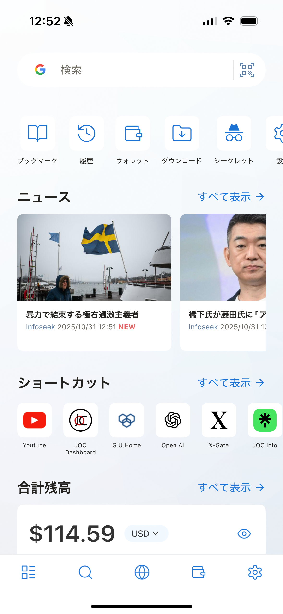
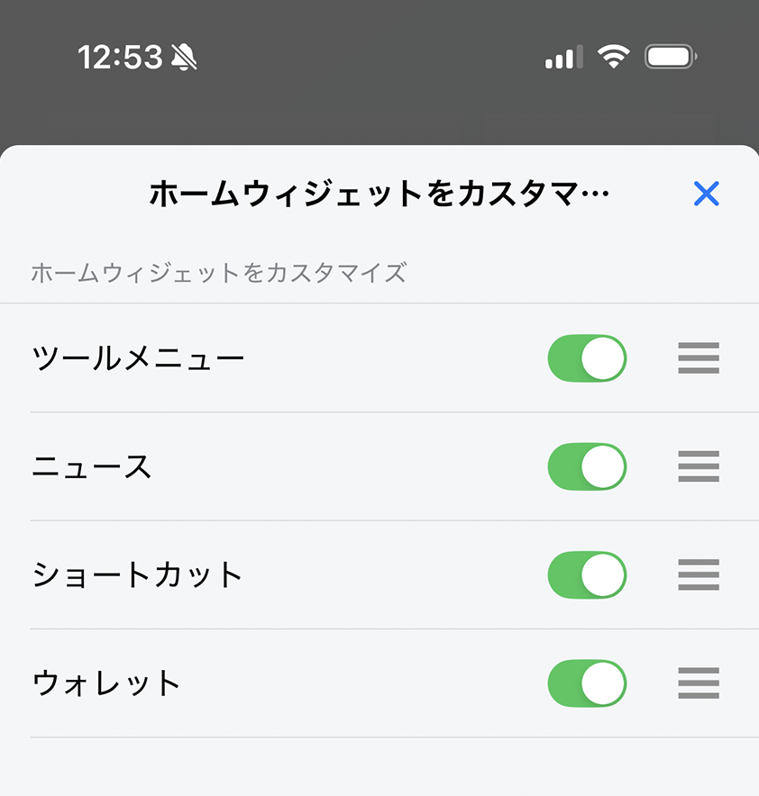

---
navigation:
  title: "概要"
---

# ホーム画面

ホーム画面には、検索、ブラウザツール、ニュース、ショートカット、ウォレット情報がまとまっています。ウィジェットをタップして機能を開いたり、よく使う機能が上に来るように並べ替えたりできます。

## ホーム画面をカスタマイズする

1. **設定**を開きます。
2. **一般** > **ホームウィジェットをカスタマイズ**を開きます。
3. ウィジェットの表示／非表示を切り替え、使いやすい順に並べます。

## ホーム画面の機能

| 機能 | できること |
| --- | --- |
| [クイック検索](quick-search.md) | Web検索またはQRコードの読み取り。 |
| [ツールメニュー](tool-menu.md) | ブックマーク、履歴、ダウンロード、設定などを開く。 |
| [ニュース](news.md) | 設定したRSSフィードの記事を読む。 |
| [ブラウザショートカット](browser-shortcuts.md) | 保存したWebサイトを直接開く。 |
| [ウォレット](wallets.md) | アカウント残高と資産を確認する。 |
