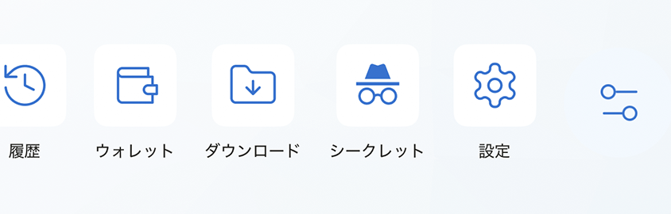
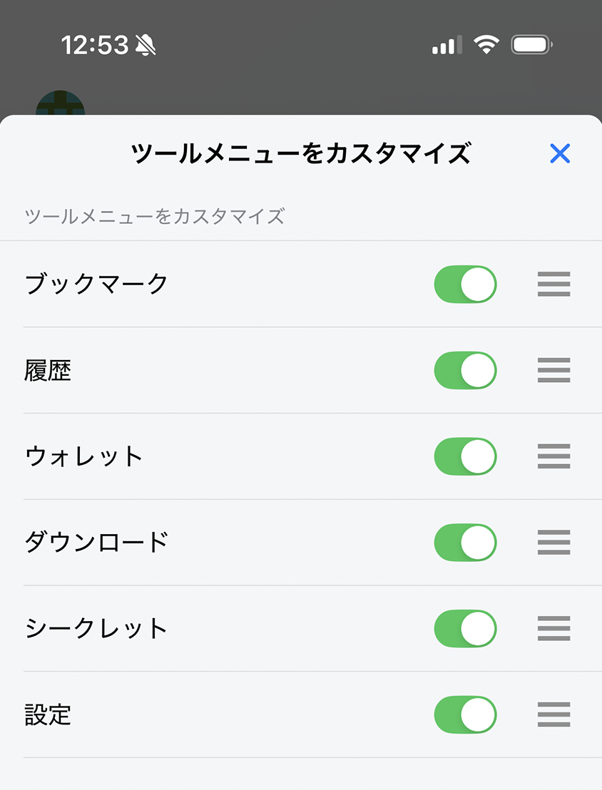

# ツールメニュー

ツールメニューから、ブックマーク、履歴、ウォレット、ダウンロード、設定、iOS版のプライベートモードなど、よく使う機能をすばやく開けます。

## ツールを開く

1. ホーム画面を開きます。
2. ツールメニューのウィジェットを探します。
3. 使用するツールをタップします。

## ツールメニューをカスタマイズする

1. **設定**を開きます。
2. **一般** > **ツールメニューをカスタマイズ**を開きます。
3. ショートカットの表示／非表示を切り替え、使いやすい順に並べます。

変更内容はホーム画面のツールメニューへ反映されます。

## 関連項目

- [ブックマーク](../../../browser/i18n/ja/bookmarks.md)
- [閲覧履歴](../../../browser/i18n/ja/browsing-history.md)
- [ファイルのダウンロード](../../../browser/i18n/ja/download-file.md)
