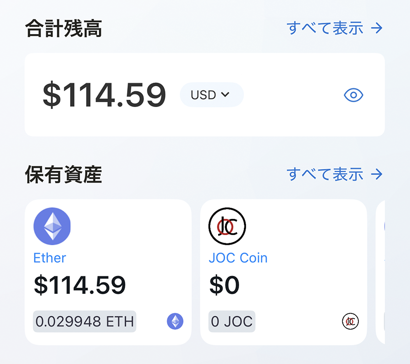

---
navigation:
  title: "ウォレット"
---

# ウォレット

ウォレットウィジェットには、選択中のWeb3ウォレットアカウント、残高、資産の概要が表示されます。

## ウォレット情報を確認する

1. ホーム画面でウォレットウィジェットを探します。
2. 選択中のアカウントと総残高を確認します。
3. ウィジェットをタップしてウォレットダッシュボードを開きます。

ウォレットが未作成の場合は、アカウント情報を表示する前にウォレットの作成またはインポートを求められます。

> **重要:** シードフレーズ、秘密鍵、ウォレットパスワードは第三者へ共有しないでください。

## 関連項目

- [ウォレットを作成する](../../../wallet/i18n/ja/create-wallet.md)
- [ウォレットダッシュボード](../../../wallet/i18n/ja/wallet-dashboard.md)
