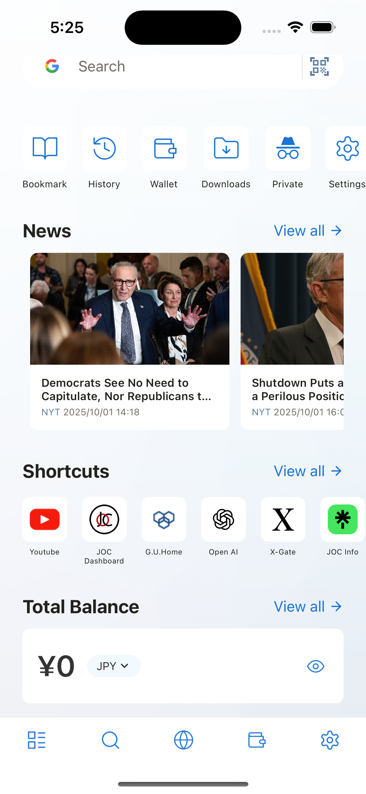

---
navigation:
  title: "Overview"
  order: 100
---

# Home screen

The Home screen brings search, browser tools, news, shortcuts, and wallet information together in one place. Tap a widget to open it, or customize the layout so frequently used features appear first.

## Customize the Home screen

1. Open **Settings**.
2. Open **General** > **Customize Home Widget**.
3. Show or hide widgets and arrange them in the order you prefer.

## Home screen features

| Feature | What you can do |
| --- | --- |
| [Quick Search](quick-search.md) | Search the web or scan a QR code. |
| [Tool Menu](tool-menu.md) | Open bookmarks, history, downloads, settings, and other tools. |
| [News](news.md) | Read articles from configured RSS feeds. |
| [Browser Shortcuts](browser-shortcuts.md) | Open saved websites directly. |
| [Wallet](wallets.md) | Check your account balance and assets. |
