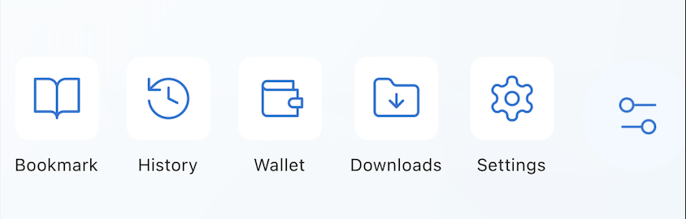
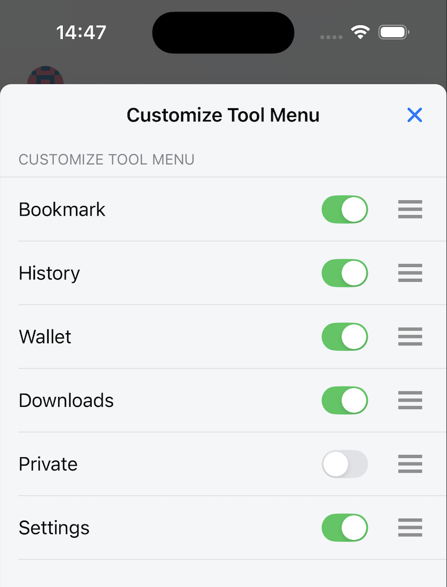

---
navigation:
  order: 300
---

# Tool Menu

The Tool Menu provides shortcuts to common browser features, including bookmarks, history, the wallet, downloads, settings, and Private Mode on iOS.

## Open a tool

1. Open the Home screen.
2. Find the Tool Menu widget.
3. Tap the tool you want to use.

## Customize the Tool Menu

1. Open **Settings**.
2. Open **General** > **Customize Tool Menu**.
3. Show or hide shortcuts and arrange them in the order you prefer.

Changes are reflected in the Tool Menu on the Home screen.

## Related topics

- [Bookmarks](../browser/bookmarks.md)
- [Browsing History](../browser/browsing-history.md)
- [File Downloads](../browser/download-file.md)
