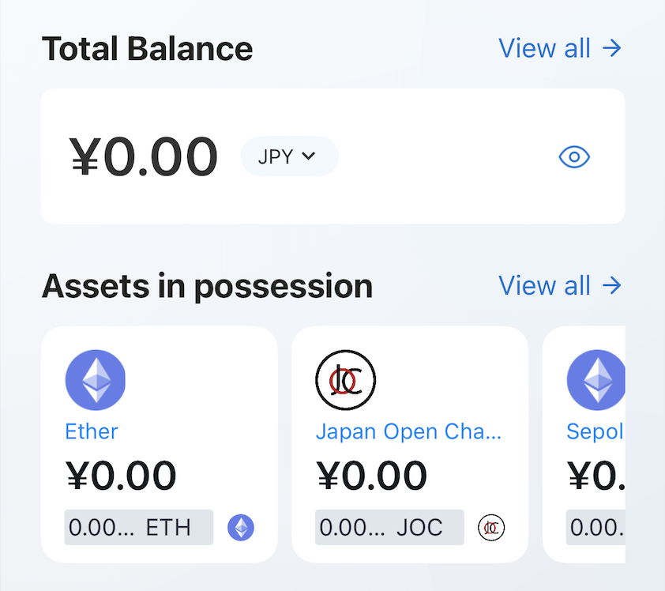

---
navigation:
  title: "Wallets"
  order: 600
---

# Wallet

The Wallet widget provides a quick view of the selected Web3 wallet account, including its balance and assets.

## View wallet information

1. Find the Wallet widget on the Home screen.
2. Review the selected account and total balance.
3. Tap the widget to open the Wallet Dashboard.

If no wallet exists, Lunascape asks you to create or import one before showing account information.

> **Important:** Never share your seed phrase, private key, or wallet password.

## Related topics

- [Create a wallet](../wallet/create-wallet.md)
- [Wallet Dashboard](../wallet/wallet-dashboard.md)
