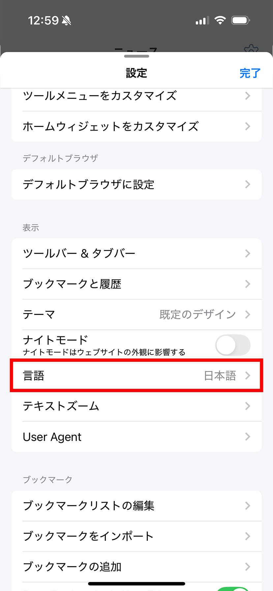
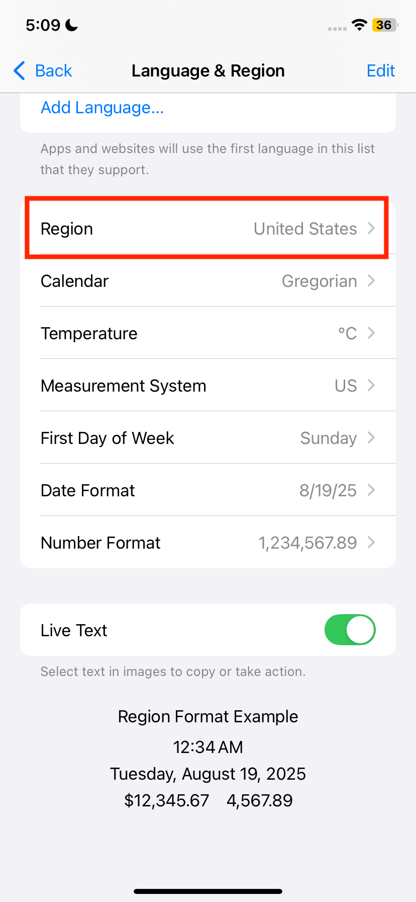

# デフォルトRSSソース

Lunascapeは、アプリの言語と必要に応じて端末の地域を使って初期RSSフィードを選択します。これらの設定を変更すると、**フィードをリセット**したときに復元されるリストも変わることがあります。

## アプリの言語を変更する

1. Lunascapeの**設定**を開きます。
2. **表示** > **言語**を開きます。
3. 使用する言語を選択します。

## iOSで地域を変更する

1. iOSの**設定**アプリを開きます。
2. **一般** > **言語と地域**を開きます。
3. **地域**を選び、使用する地域へ変更します。

対応する初期リストを適用するには、Lunascapeへ戻り、[ニュース設定](news-setting.md)で**フィードをリセット**してください。

> **注意:** フィードをリセットすると、独自に追加・削除・並べ替えた内容は失われます。
