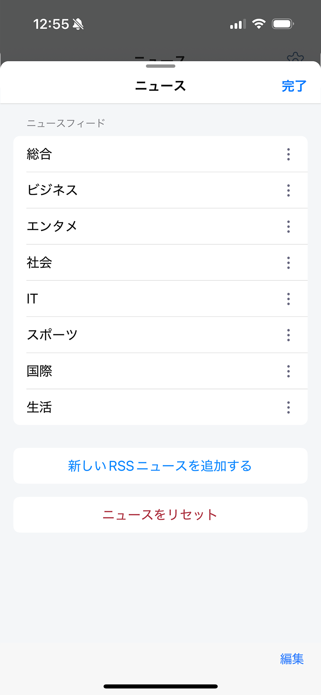
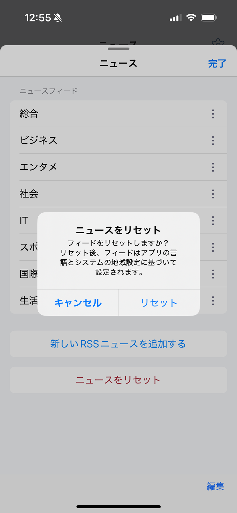

---
navigation:
  title: "ニュース設定"
---

# ニュース設定

ニュース画面に表示するRSSフィードを管理します。

## フィードを追加・編集する

1. **設定** > **一般** > **ニュース**を開きます。
2. フィードを追加するか、既存のフィードを選んで編集します。
3. フィード名とRSS URLを入力します。
4. 変更を保存します。

フィードの削除と表示順の変更もできます。

## デフォルトフィードへ戻す

1. ニュース設定画面を開きます。
2. **フィードをリセット**を選びます。
3. リセットを確定します。

現在のリストは、アプリの言語と端末の地域に対応する初期リストへ置き換わります。詳しくは[デフォルトRSSソース](default-rss-sources.md)を参照してください。

> **注意:** リセットすると、フィードリストに加えた変更は失われます。
