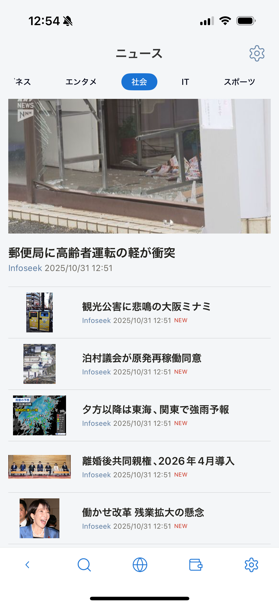

---
navigation:
  title: "概要"
---

# ニュース概要

ニュース機能では、複数のRSSフィードの記事を1か所にまとめて確認できます。アプリの言語と端末の地域に応じた初期フィードが用意されており、任意のRSSソースも追加できます。

## ニュース画面を使う

1. ホーム画面から**ニュース**を開きます。
2. ニュースソースまたはフィードを選びます。
3. 記事をタップしてブラウザで開きます。

安定して取得するにはRSS 2.0対応のフィードを使用してください。アドレスへ接続できない場合や未対応形式の場合は、記事が表示されないことがあります。

## ニュースに関する操作

| 操作 | ヘルプ |
| --- | --- |
| フィードの追加、編集、削除、初期化 | [ニュース設定](news-setting.md) |
| アプリ更新後にニュースソースを確認 | [ニュースソース選択](news-sources-selection.md) |
| デフォルトソースの選択方法を確認 | [デフォルトRSSソース](default-rss-sources.md) |
