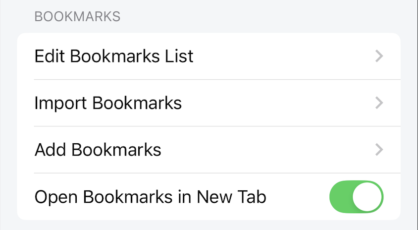
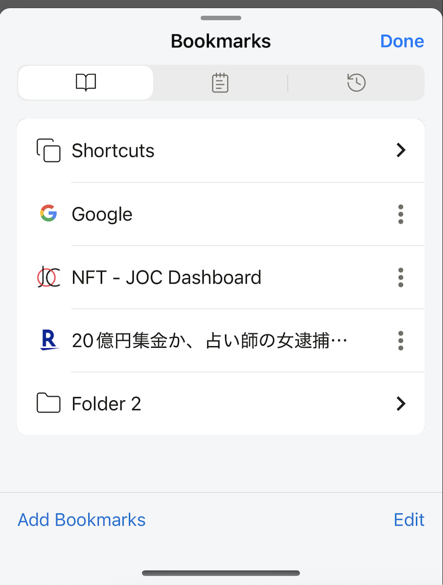

---
navigation:
  title: "Bookmarks"
  order: 500
---

# Bookmark settings

Open **Settings** > **Bookmarks** to import, organize, or change how bookmarks open.

## Organize bookmarks

Tap **Edit Bookmarks List** to add, rename, move, or delete bookmarks and folders.

## Import bookmarks

1. Export bookmarks from Safari or another browser in a supported bookmark file format.
2. In Lunascape, tap **Import Bookmarks**.
3. Select the exported file and confirm the import.

## Add the open page

Tap **Add Bookmarks** to save the page that is currently open in the browser.

## Choose where bookmarks open

**Open Bookmarks in New Tab** controls whether a bookmark opens in a new tab or replaces the page in the current tab.

**Default:** On

## Related topics

- [Use bookmarks](../browser/bookmarks.md)
- [Browser shortcuts](../home/browser-shortcuts.md)
