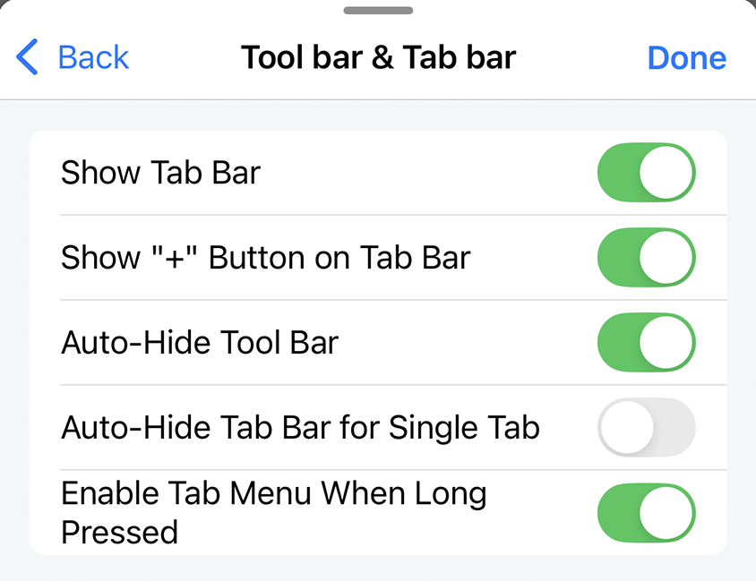
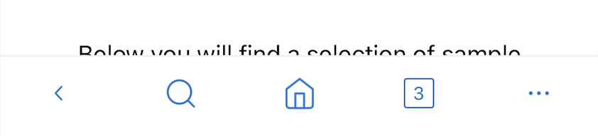
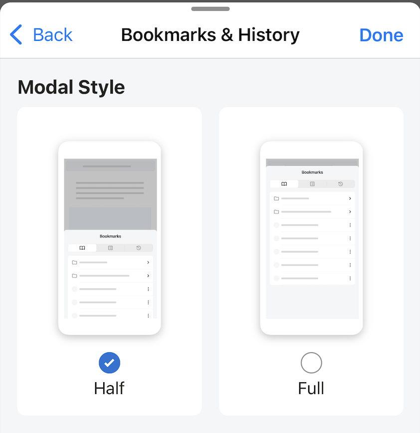
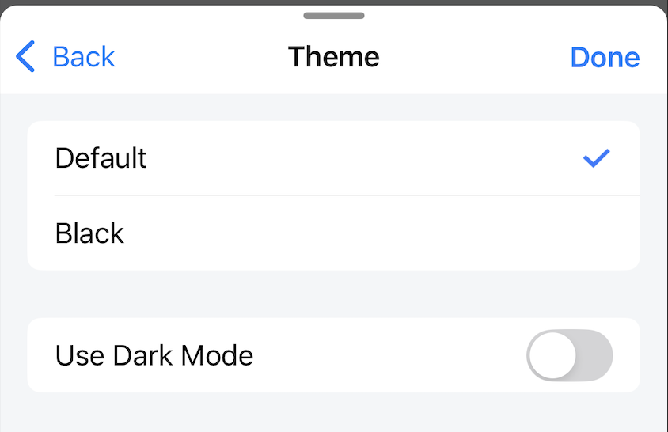
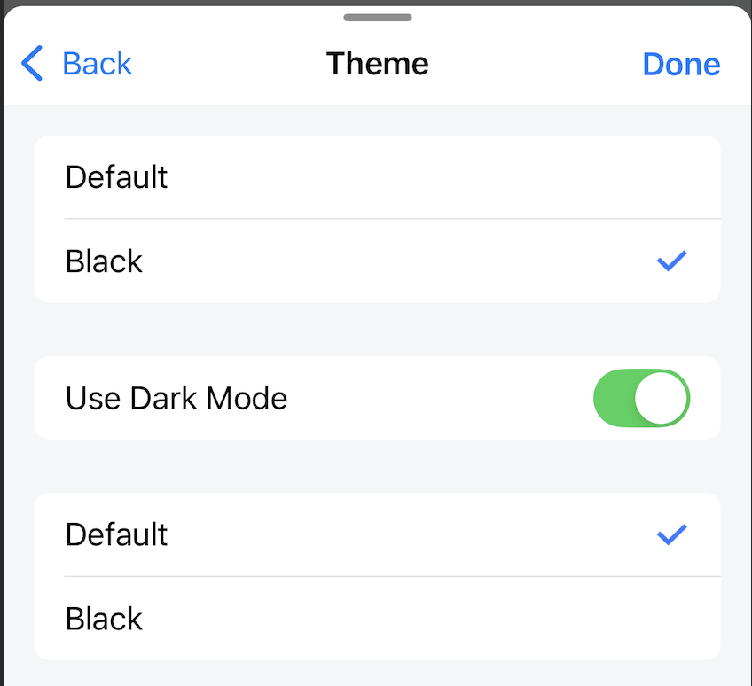
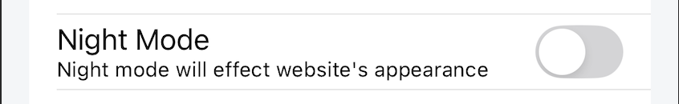
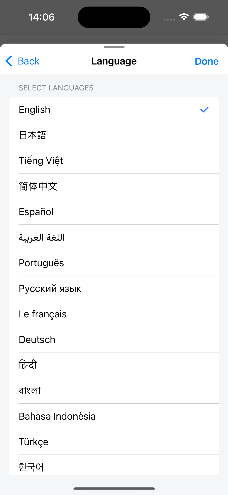

---
navigation:
  title: "Display"
  order: 400
---

# Display settings

Open **Settings** > **Display** to change the app interface, website appearance, language, and advanced display behavior.

## Toolbar and tab bar

| Setting | What it does | Default |
| --- | --- | --- |
| **Show Tab Bar** | Shows the tab bar. When off, a tab-count button appears instead. | On |
| **Auto-Hide Tool Bar** | Hides the toolbar and tab bar while scrolling down, then shows them when scrolling up. | On |
| **Auto-Hide Tab Bar for Single Tab** | Hides the tab bar when only one tab is open. | Off |
| **Enable Tab Menu When Long Pressed** | Opens the tab action menu when you touch and hold a tab. | On |

Tab bar shown:

Tab-count button shown instead:

Long-press tab menu:

## Bookmarks and history layout

**Modal Style** changes the Bookmarks and History panel between **Half** and **Full** height.

**Default:** Half

## App theme

The app theme changes Lunascape's interface, but not the appearance of websites. Choose **Default** (light) or **Black**.

- When **Use Dark Mode** is off, the app always uses the first selected theme.
- When **Use Dark Mode** is on, the app uses the first theme for the system's light mode and the second theme for the system's dark mode.

**Default theme:** Default

## Website Night Mode

Night Mode changes the appearance of websites. It is separate from the app theme and is initially off.

Night Mode off:

Night Mode on:

> **Note:** Some websites control their own colors and may not display correctly in Night Mode. Turn it off for those sites.

## Language

Choose the language used by the Lunascape interface. The initial language follows the device language at the time the app is installed.

## Text zoom by website

This list shows websites with a custom text zoom level. Remove a website from the list to return its text size to the normal scale.

## User agent

Advanced users can set different user-agent strings for mobile and desktop site views, or reset both to the app defaults.

**Reset User Agent When Open App** restores the default strings whenever Lunascape starts.

**Default:** On

> **Caution:** An invalid user-agent string can cause websites to show the wrong layout or stop working. Reset it if problems begin after a change.

## Related topics

- [Tab operations](../browser/tab-operations.md)
- [Browser Tool Menu](../browser/browser-tool-menu.md)
