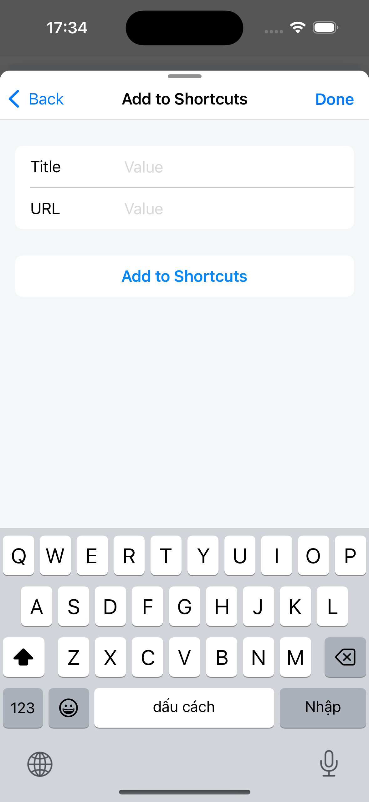
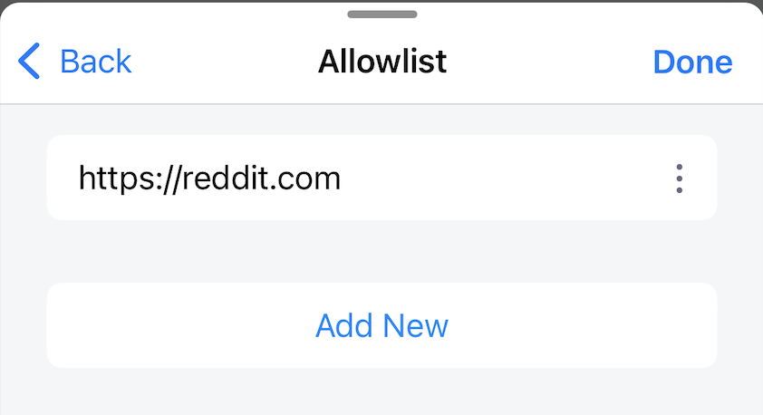
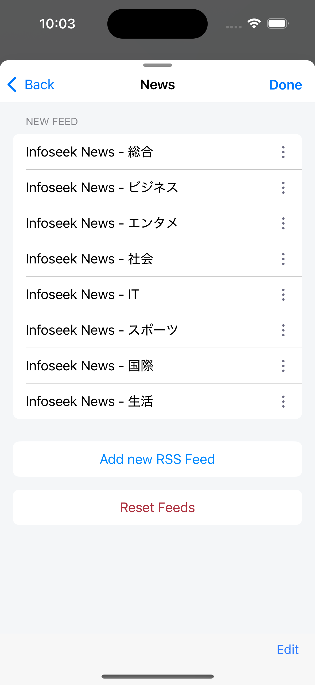

---
navigation:
  title: "General"
  order: 200
---

# General settings

Open **Settings** > **General** to configure app actions, tabs, shortcuts, ad blocking, News, and the Home screen.

## Actions

| Setting | What it does | Default |
| --- | --- | --- |
| **Lock Rotation** | Keeps Lunascape in portrait orientation. When off, Lunascape follows device rotation unless rotation is locked at the system level. | Off |
| **Scroll to Top** (iOS only) | Scrolls the open page to the top when you tap the right side of the status bar. | On |
| **Save Image in Photo Album/Gallery** | Saves images to Photos or Gallery when on. When off, images are saved in the **Downloads** folder. | Off |

## Tabs

| Setting | What it does | Default |
| --- | --- | --- |
| **Restore Tabs** | Reopens tabs from the previous session when Lunascape starts. | On |
| **Open New Tab from Address Bar** | Opens a URL or search entered in the address bar in a new tab. When off, the current tab is reused. | On |
| **Use the Sliding Tab Bar Version** | Lets you swipe the tab bar to switch tabs. When off, tabs appear in a horizontally scrolling list. | On |
| **Set Maximum Tab** | Sets the number of tabs that can be open, from 6 to 30. | 12 |

> **Tip:** A warning appears above 12 tabs. A high limit can increase memory use and reduce browsing performance.

## Shortcuts

Tap **Edit Shortcuts List** to create, reorder, or delete shortcuts, or to restore the default list.

Tap **Add to Shortcuts** to create a shortcut for a website.

**Open Shortcuts in New Tab** opens shortcuts in a new tab when enabled. When disabled, the current tab is reused.

**Default:** On

## Ad blocker

Turn on **Enable AdBlocker** to block supported ads. The initial setting is off. Reload open pages after changing it.

Use **Allowlist** to add or remove websites where ads should remain visible.

> **Note:** If a website does not display or work correctly, add it to the Allowlist and reload the page.

## News feeds

Add, edit, delete, or reorder the RSS feeds shown on the News screen. **Reset Feeds** restores the default feeds for the app's current language.

> **Important:** Resetting feeds replaces your customized feed list.

## Customize the Home screen

Use **Customize Tool Menu** to reorder or show and hide the tools on the Home screen.

Use **Customize Home Widget** to reorder or show and hide Home screen widgets.

## Related topics

- [Tab operations](../browser/tab-operations.md)
- [Ad blocking](../browser/ad-blocking.md)
- [Manage News feeds](../news/news-setting.md)
- [Customize the Tool Menu](../home/tool-menu.md)
