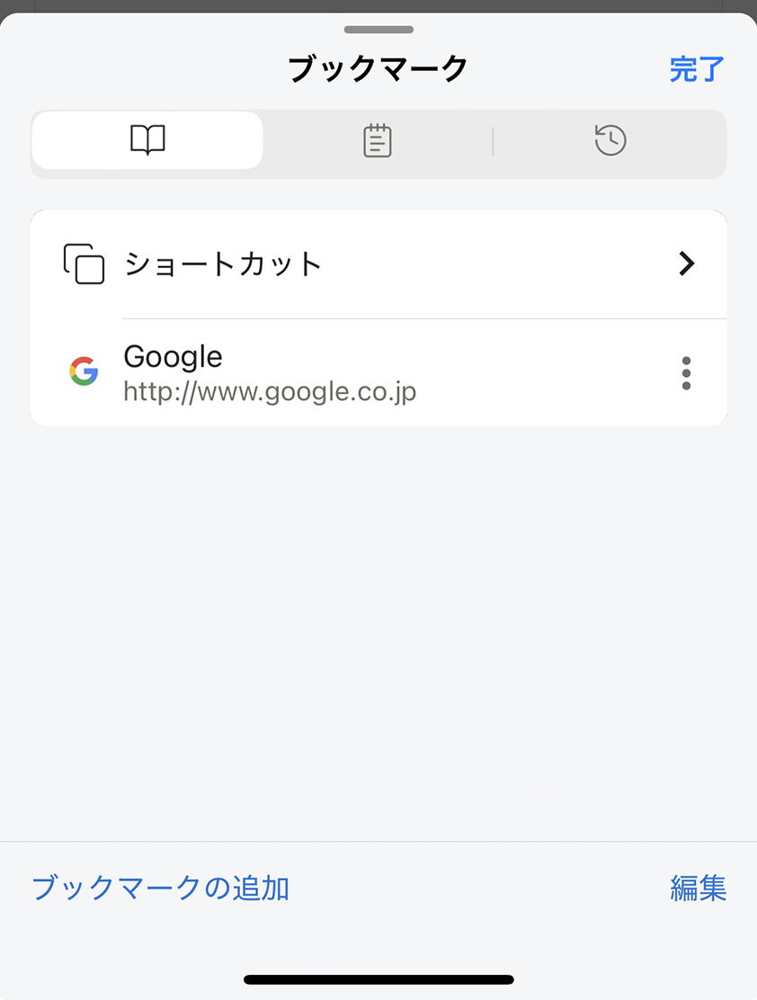
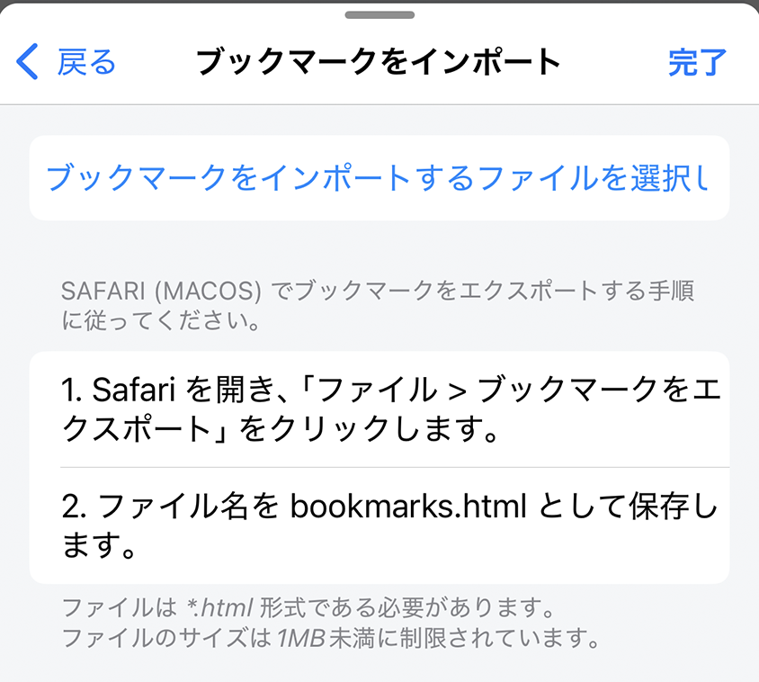

---
navigation:
  title: "ブックマーク"
---

# ブックマーク設定

**設定** > **ブックマーク**では、ブックマークの取り込みや整理、開き方の変更ができます。

## ブックマークを整理する

**ブックマークリストを編集**をタップすると、ブックマークやフォルダーの追加、名前変更、移動、削除ができます。

## ブックマークをインポート

1. Safariなどのブラウザから、対応するブックマークファイルを書き出します。
2. Lunascapeで**ブックマークをインポート**をタップします。
3. 書き出したファイルを選び、取り込みを確定します。

## 表示中のページを追加する

**ブックマークを追加**をタップすると、ブラウザで現在開いているページを保存できます。

## 新しいタブでブックマークを開く

**新しいタブでブックマークを開く**を有効にすると、選んだブックマークが新しいタブで開きます。無効にすると、現在のタブのページが置き換わります。

**初期値:** 有効

## 関連項目

- [ブックマークを使う](../../../browser/i18n/ja/bookmarks.md)
- [ブラウザショートカット](../../../home/i18n/ja/browser-shortcuts.md)
