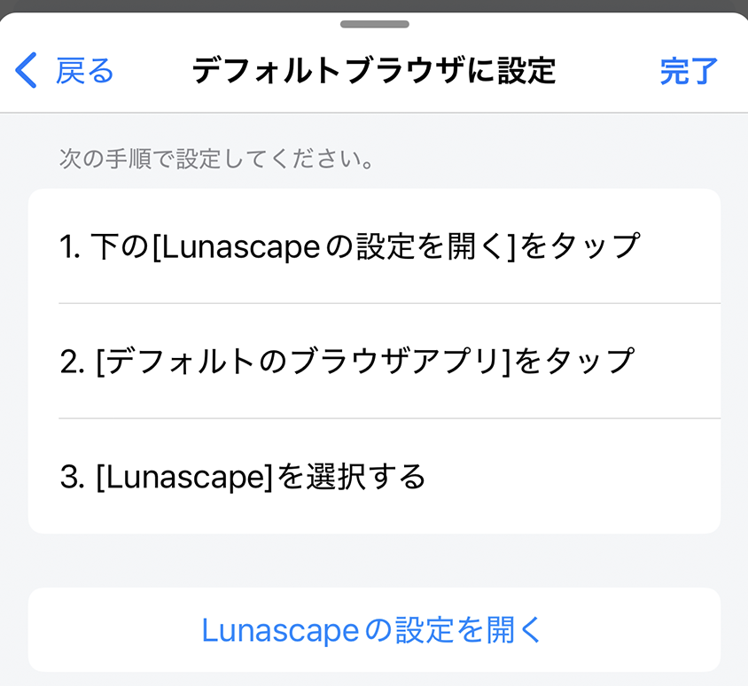

---
navigation:
  title: "デフォルトブラウザ"
---

# Lunascapeをデフォルトブラウザにする

デフォルトブラウザに設定すると、メールやメッセージなど、ほかのアプリでタップしたリンクがLunascapeで開きます。

## デフォルトブラウザを変更する

1. Lunascapeの**設定**を開きます。
2. **デフォルトブラウザ**をタップします。
3. **デフォルトブラウザを設定**をタップします。
4. 端末の設定画面で、デフォルトのブラウザアプリにLunascapeを選びます。
5. 設定後、Lunascapeへ戻ります。

> **注意:** 端末の設定画面や名称は、iOSとAndroidのバージョンによって異なります。項目が表示されない場合は、OSとLunascapeを更新してから再度お試しください。
