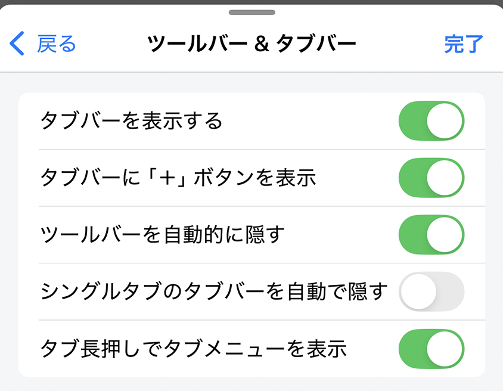
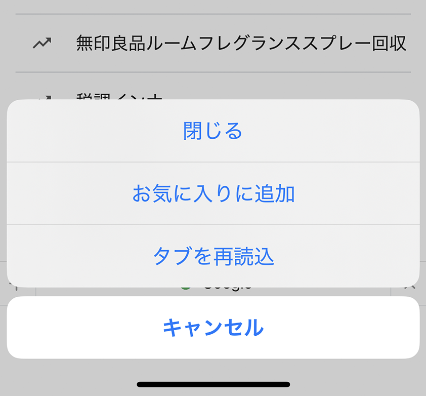
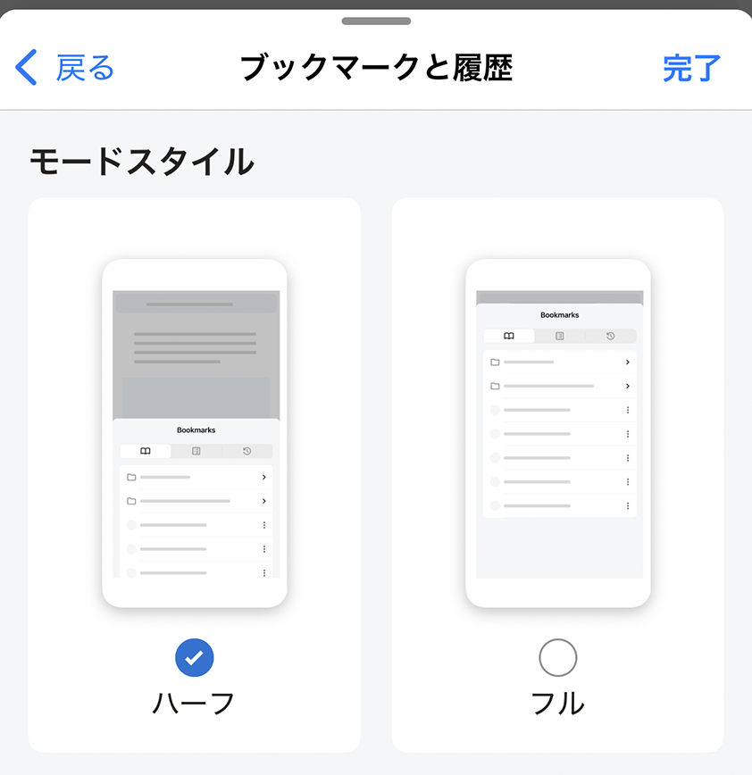
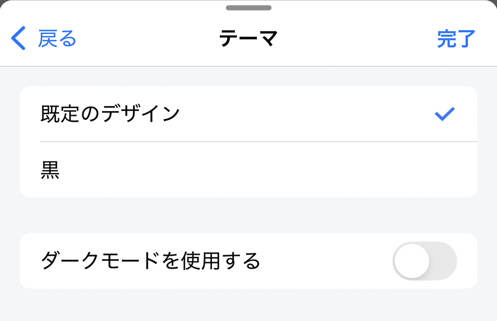
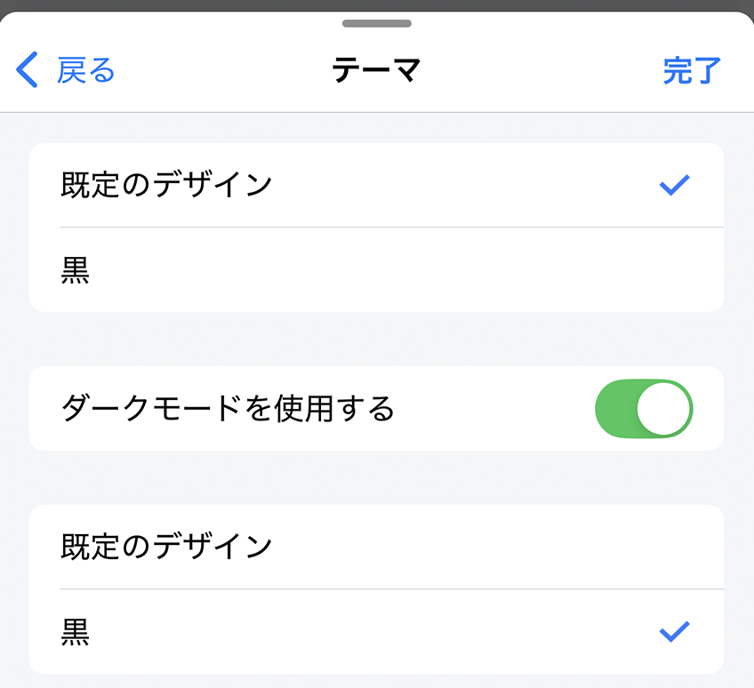
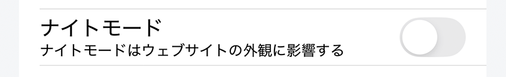
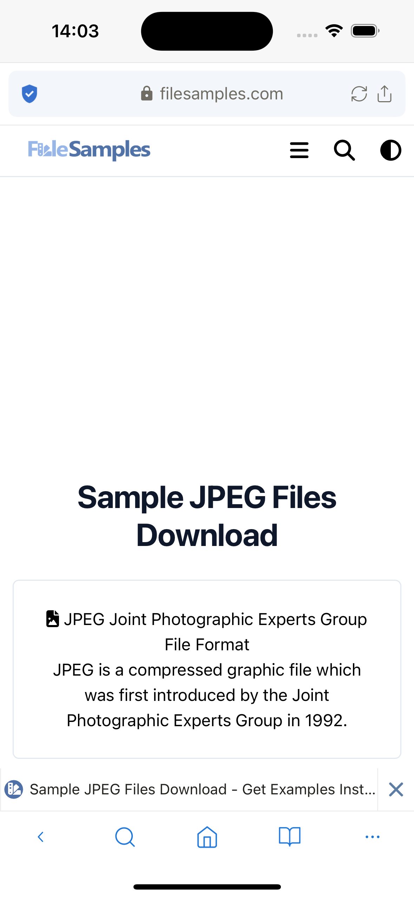
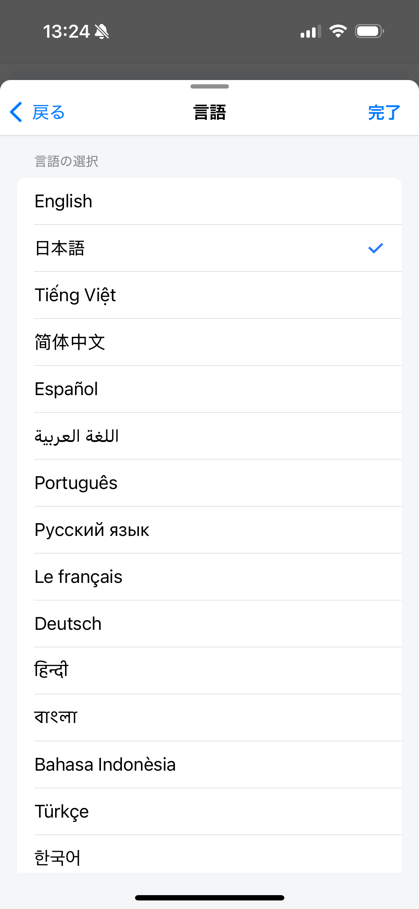
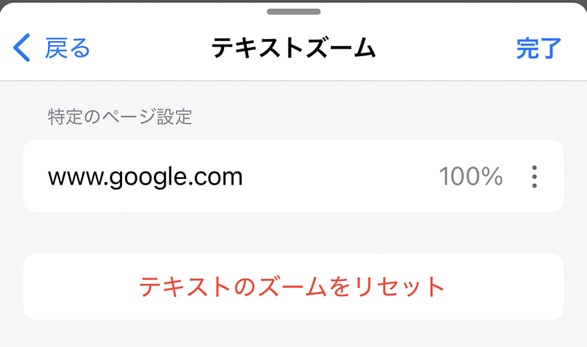
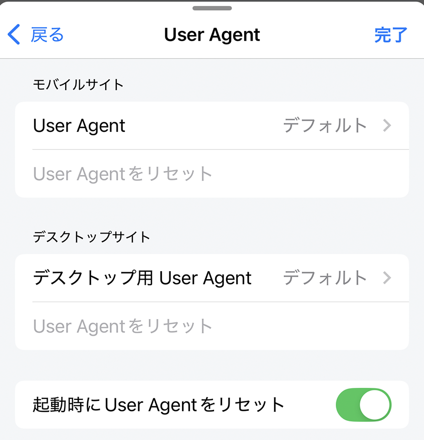

---
navigation:
  title: "表示"
---

# 表示設定

**設定** > **表示**では、アプリの画面、Webサイトの見え方、言語、高度な表示動作を変更できます。

## ツールバーとタブバー

| 設定 | 動作 | 初期値 |
| --- | --- | --- |
| **タブバーを表示** | タブバーを表示します。無効時は、代わりに開いているタブ数のボタンを表示します。 | 有効 |
| **ツールバーを自動的に隠す** | 下へスクロールするとツールバーとタブバーを隠し、上へスクロールすると再表示します。 | 有効 |
| **タブが1つのときタブバーを自動的に隠す** | 開いているタブが1つだけの場合にタブバーを隠します。 | 無効 |
| **長押しでタブメニューを有効にする** | タブを長押ししたときに操作メニューを表示します。 | 有効 |

タブバーを表示した状態：

タブ数のボタンを表示した状態：

タブの長押しメニュー：

## ブックマークと履歴の表示

**モーダルスタイル**では、ブックマークと履歴のパネルを**ハーフ**または**フル**の高さに切り替えます。

**初期値:** ハーフ

## アプリのテーマ

アプリのテーマは、Webサイトを除くLunascapeの画面に適用されます。**デフォルト**（ライト）または**ブラック**を選べます。

- **ダークモードを使用**が無効の場合、端末の設定にかかわらず、1つ目に選んだテーマを使います。
- **ダークモードを使用**が有効の場合、端末のライトモードでは1つ目、ダークモードでは2つ目に選んだテーマを使います。

**初期テーマ:** デフォルト

## Webサイトのナイトモード

ナイトモードはWebサイトの見え方を変更します。アプリのテーマとは別に動作し、初期値は無効です。

ナイトモードが無効の状態：

ナイトモードが有効の状態：

> **注意:** Webサイト側が独自に色を指定している場合、正しく表示されないことがあります。そのサイトではナイトモードを無効にしてください。

## 言語

Lunascapeの画面に使う言語を選びます。初期状態では、アプリをインストールした時点の端末言語に従います。

## Webサイトごとのテキストズーム

文字サイズを個別に変更したWebサイトが一覧表示されます。一覧からサイトを削除すると、そのサイトの文字サイズが通常の倍率へ戻ります。

## ユーザーエージェント

上級者向けの設定です。モバイル表示とデスクトップ表示で異なるユーザーエージェント文字列を指定したり、アプリの初期値へ戻したりできます。

**アプリを開くときにユーザーエージェントをリセット**を有効にすると、Lunascapeの起動時に初期値へ戻ります。

**初期値:** 有効

> **注意:** 正しくないユーザーエージェントを指定すると、Webサイトの表示や動作に問題が起きる場合があります。変更後に問題が起きた場合は初期値へ戻してください。

## 関連項目

- [タブ操作](../../../browser/i18n/ja/tab-operations.md)
- [ブラウザツールメニュー](../../../browser/i18n/ja/browser-tool-menu.md)
