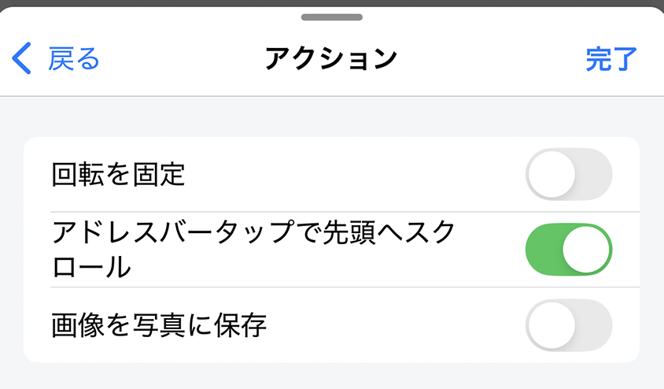
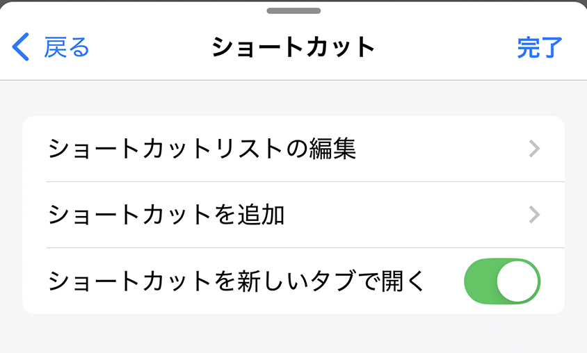
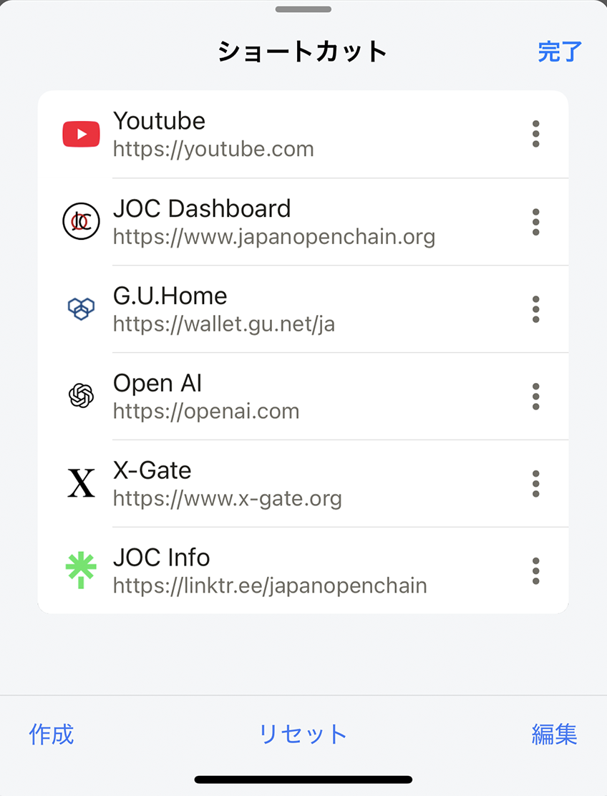
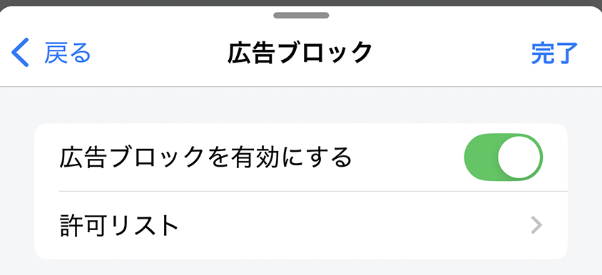
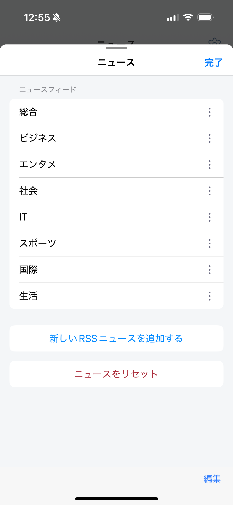
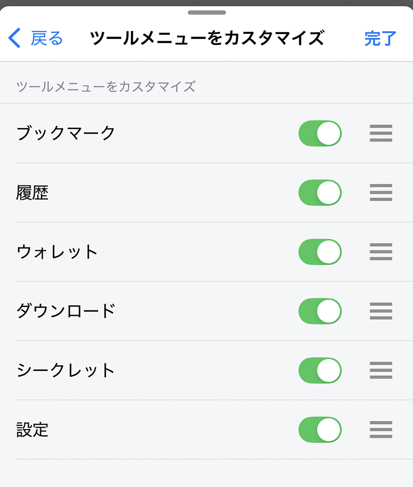
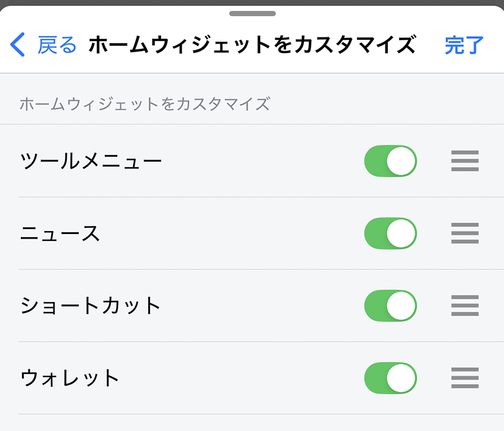

---
navigation:
  title: "一般"
---

# 一般設定

**設定** > **一般**では、アプリの基本動作、タブ、ショートカット、広告ブロック、ニュース、ホーム画面を変更できます。

## 基本動作

| 設定 | 動作 | 初期値 |
| --- | --- | --- |
| **回転ロック** | Lunascapeを縦向きで固定します。無効時は、端末側で回転がロックされていない限り端末の向きに従います。 | 無効 |
| **トップにスクロール**（iOSのみ） | ステータスバー右側をタップすると、表示中のページの先頭へ移動します。 | 有効 |
| **写真アルバム／ギャラリーに画像を保存** | 有効時は写真またはギャラリーへ保存します。無効時は**Downloads**フォルダーへ保存します。 | 無効 |

## タブ

| 設定 | 動作 | 初期値 |
| --- | --- | --- |
| **タブを復元** | Lunascapeの起動時に、前回開いていたタブを再度開きます。 | 有効 |
| **アドレスバーから新しいタブを開く** | アドレスバーへ入力したURLや検索結果を新しいタブで開きます。無効時は現在のタブを使います。 | 有効 |
| **スライド式タブバーを使用** | タブバーをスワイプしてタブを切り替えます。無効時は横スクロールする一覧形式になります。 | 有効 |
| **最大タブ数** | 同時に開けるタブ数を6〜30の範囲で設定します。 | 12 |

> **ヒント:** 最大タブ数を12より大きくすると警告が表示されます。大きな値はメモリ使用量を増やし、ブラウザの動作に影響する場合があります。

## ショートカット

**ショートカットリストを編集**では、ショートカットの作成、並べ替え、削除、初期状態への復元ができます。

**ショートカットに追加**をタップすると、Webサイトのショートカットを作成できます。

**新しいタブでショートカットを開く**を有効にすると、ショートカットが新しいタブで開きます。無効時は現在のタブを使います。

**初期値:** 有効

## 広告ブロッカー

**広告ブロッカーを有効にする**をオンにすると、対応する広告をブロックします。初期値は無効です。変更後は、開いているWebページを再読み込みしてください。

**許可リスト**では、広告を表示するWebサイトを追加・削除できます。

> **注意:** Webサイトが正しく表示・動作しない場合は、そのサイトを許可リストへ追加して再読み込みしてください。

## ニュースフィード

ニュース画面に表示するRSSフィードを追加、編集、削除、並べ替えできます。**フィードをリセット**を実行すると、現在のアプリ言語に対応する初期フィードへ戻ります。

> **重要:** フィードをリセットすると、カスタマイズしたフィード一覧が置き換わります。

## ホーム画面をカスタマイズする

**ツールメニューをカスタマイズ**では、ホーム画面のツールを並べ替えたり、表示・非表示を切り替えたりできます。

**ホームウィジェットをカスタマイズ**では、ホーム画面のウィジェットを並べ替えたり、表示・非表示を切り替えたりできます。

## 関連項目

- [タブ操作](../../../browser/i18n/ja/tab-operations.md)
- [広告ブロック](../../../browser/i18n/ja/ad-blocking.md)
- [ニュースフィードを管理する](../../../news/i18n/ja/news-setting.md)
- [ツールメニューをカスタマイズする](../../../home/i18n/ja/tool-menu.md)
