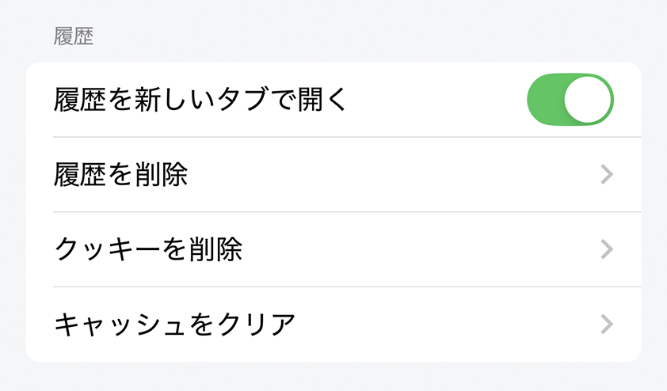

---
navigation:
  title: "履歴"
---

# 履歴とWebサイトデータ

**設定** > **履歴**では、履歴の開き方を変更したり、閲覧データを削除したりできます。

## 新しいタブで履歴を開く

**新しいタブで履歴を開く**を有効にすると、選んだ履歴が新しいタブで開きます。無効にすると、現在のタブのページが置き換わります。

**初期値:** 有効

## 履歴をクリア

**履歴をクリア**をタップし、確認すると、すべての閲覧履歴が削除されます。

## Cookieを削除

**Cookieを削除**をタップし、確認すると、Webサイトが保存したCookieが削除されます。Webサイトからログアウトしたり、サイトごとの設定が初期化されたりする場合があります。

## キャッシュをクリア

**キャッシュをクリア**をタップし、確認すると、画像、HTML、CSSなどの一時ファイルが削除されます。次回の表示時はファイルを再取得するため、読み込みに時間がかかることがあります。

> **重要:** 削除した履歴、Cookie、キャッシュは元に戻せません。ブックマークとダウンロード済みファイルは、これらの操作では削除されません。

## 関連項目

- [ブラウジング履歴](../../../browser/i18n/ja/browsing-history.md)
- [プライバシー設定](privacy.md)
