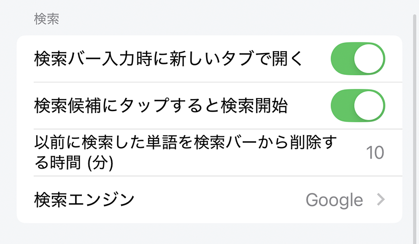

---
navigation:
  title: "検索"
---

# 検索設定

**設定** > **検索**では、検索サービスや候補・検索結果の動作を変更できます。

## 検索バーから新しいタブを開く

**検索バーから新しいタブを開く**を有効にすると、検索結果が新しいタブで開きます。無効にすると、現在のタブのページが置き換わります。

**初期値:** 有効

## 提案のタップで検索

有効にすると、検索候補をタップした時点で検索を実行します。無効にすると、候補を検索欄へ入力し、編集してから検索できます。

**初期値:** 有効

## 前回の検索語を消去するまでの時間

前回の検索語を検索欄に残す時間を、0〜60分で設定します。

**初期値:** 10分

## 検索エンジン

検索に使うサービスを選びます。Lunascapeでは次のサービスを利用できます。

- Google
- Bing
- Amazon
- YouTube
- Twitter/X
- Wikipedia
- DeepL
- eBay

**初期値:** Google

## 関連項目

- [Webを検索する](../../../browser/i18n/ja/search.md)
- [クイック検索](../../../home/i18n/ja/quick-search.md)
