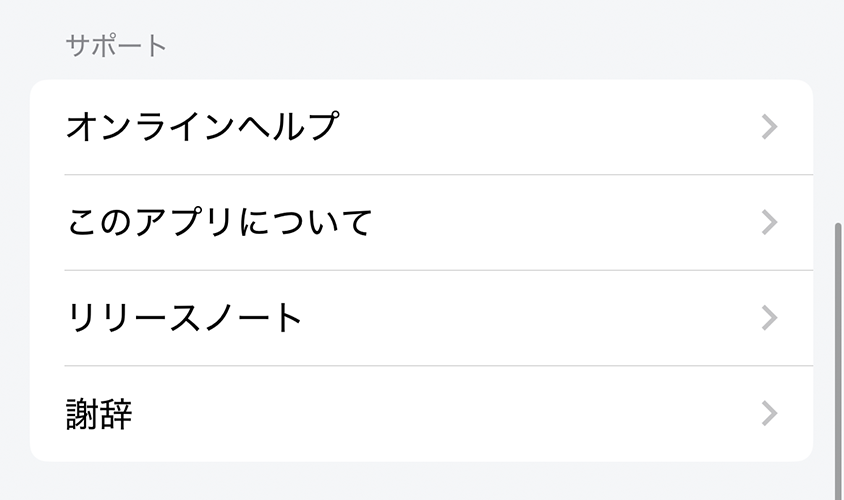
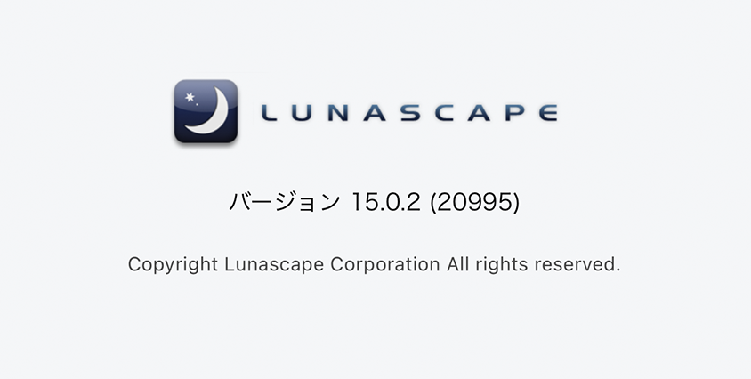
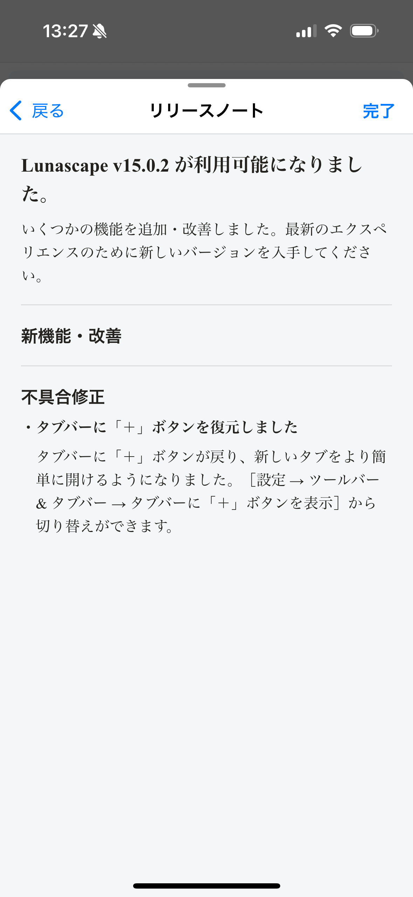
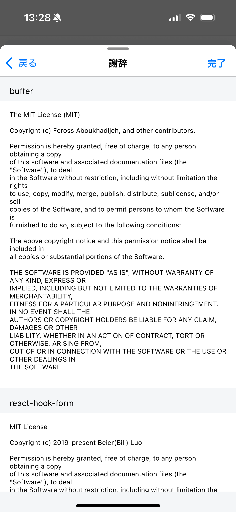

---
navigation:
  title: "サポート"
---

# ヘルプとアプリ情報

**設定** > **サポート**では、ヘルプやインストール済みバージョンの情報を確認できます。

## オンラインヘルプ

Lunascapeの[FAQ](https://help.gu.net/lunascape-for-mobile-faq)を開き、よくある問題の回答を確認できます。問い合わせる場合は、アプリのバージョン、端末名、OSのバージョン、問題を再現する手順を記載してください。パスワード、リカバリーフレーズ、秘密鍵は記載しないでください。

## このアプリについて

インストールされているLunascapeのバージョンなどを表示します。

## リリースノート

インストールされているバージョンの新機能、変更点、修正内容を表示します。

## 謝辞

Lunascapeで使用しているオープンソースソフトウェアの通知とライセンスを表示します。

