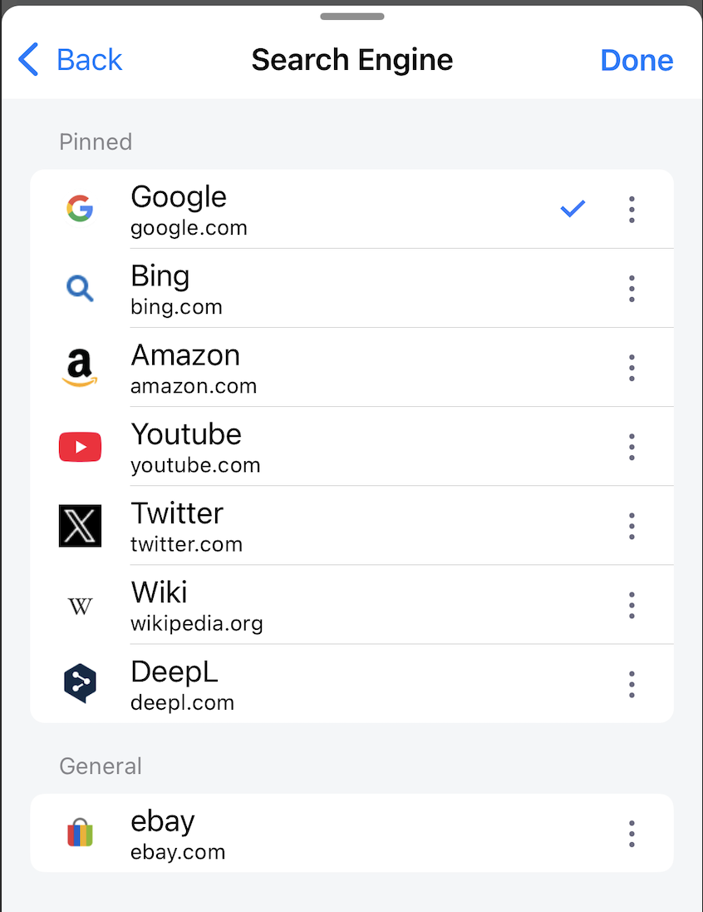

---
navigation:
  title: "Search"
  order: 600
---

# Search settings

Open **Settings** > **Search** to choose a search provider and control how suggestions and results behave.

## Open results in a new tab

When **Open New Tab from Search Bar** is enabled, results open in a new tab. When disabled, results replace the current page.

**Default:** On

## Search when a suggestion is tapped

When enabled, tapping a suggestion starts the search immediately. When disabled, the suggestion is copied into the search field so you can edit it first.

**Default:** On

## Clear the previous search term

Choose how long the previous search term remains in the search field. You can select from 0 to 60 minutes.

**Default:** 10 minutes

## Search Engine

Choose the provider used for searches. Lunascape includes:

- Google
- Bing
- Amazon
- YouTube
- Twitter/X
- Wikipedia
- DeepL
- eBay

**Default:** Google

## Related topics

- [Search the web](../browser/search.md)
- [Quick Search](../home/quick-search.md)
