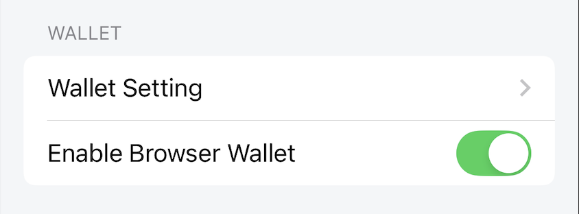

---
navigation:
  title: "Wallet"
  order: 800
---

# Wallet Settings

Open **Settings** > **Wallet** to show or hide Browser Wallet features and open the detailed wallet settings.

## Open wallet settings

Tap **Wallet Setting** to manage wallet-specific preferences.

## Enable Browser Wallet

When enabled, Browser Wallet features are shown in the app. When disabled, those entry points are hidden and wallet functions cannot be used until the option is enabled again.

**Default:** On

> **Note:** Turning this option off does not delete an existing wallet. Never share a recovery phrase or private key.

## Related topics

- [Wallet overview](../wallet/overview.md)
- [Wallet settings](../wallet/wallet-settings.md)
