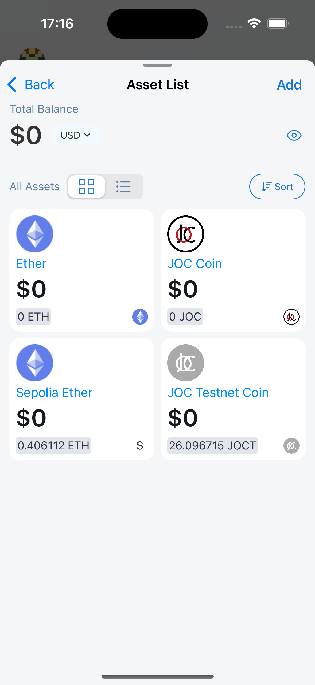
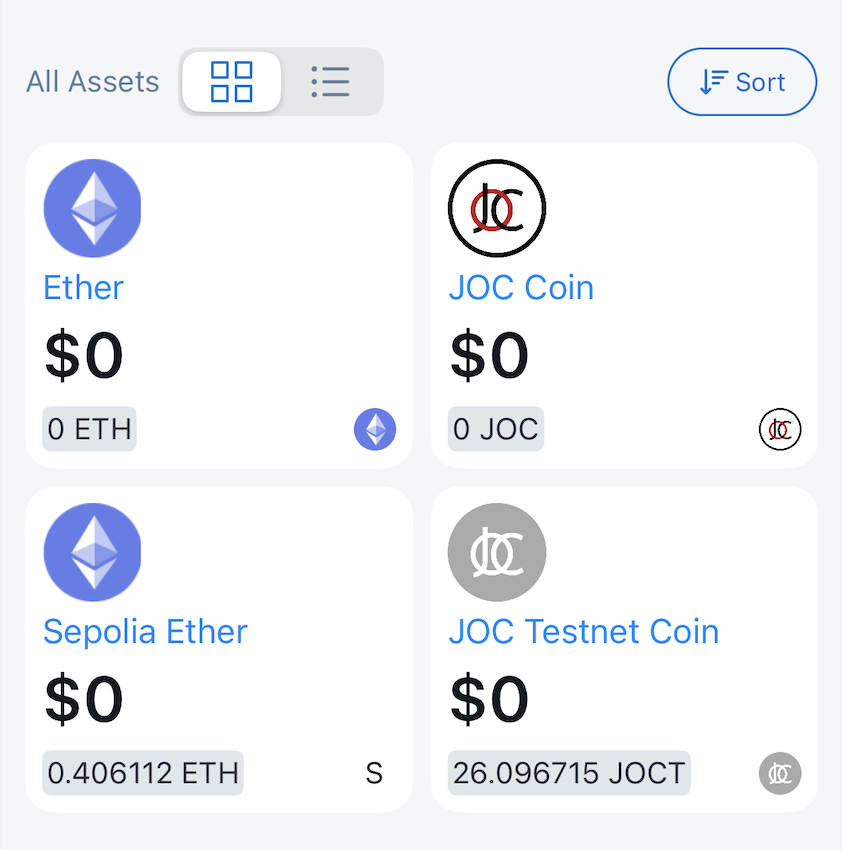
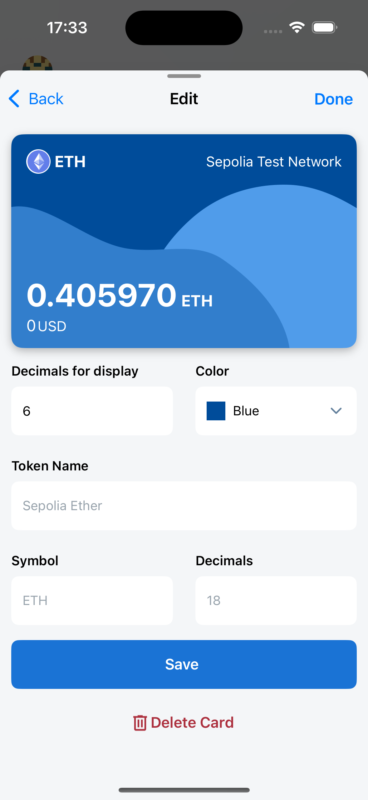

---
navigation:
  order: 400
---

# Asset List

The Asset List shows tokens and balances for the currently selected account and network.

## Total balance

The estimated total is shown in the fiat currency selected in Wallet Settings. Market-price data can be delayed or unavailable and should not be treated as an exact sale value.

## All Assets

Choose a card or list layout.

Card layout:

List layout:

You can sort assets by:

- Default: recently viewed tokens first
- Alphabetically (A-Z)
- Balance: highest estimated fiat value first

You can edit or remove a token from the displayed list. Removing a token does not transfer or destroy it on the blockchain; you can add it again later.

## Token details

Tap a token to view:

- Token name
- Token symbol
- Token balance
- Corresponding fiat value
- Token network
- Transaction history

You can also select **Send**, **Receive**, or **Scan to Send**.

- Send
- Receive
- Scan to Send

## Edit a token

You can change:

- Decimals for display
- Card Color

> **Caution:** Changing display decimals affects how the amount is shown. Confirm the token's official decimal value before changing it.
