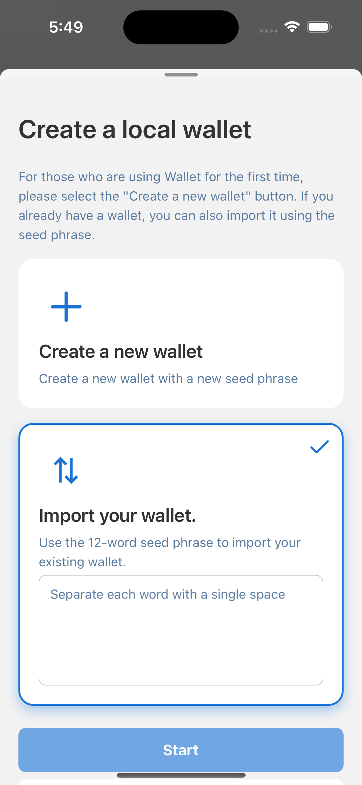

---
navigation:
  title: "Create Wallet"
  order: 200
---

# Create or import a wallet

You can create a new self-custody wallet or import an existing wallet with its recovery phrase. Choose a wallet password from 8 to 64 characters.

## Before you begin

- Use a password that is unique and difficult to guess.
- Make sure nobody can see your screen when a recovery phrase is displayed or entered.
- Prepare a secure offline place to record the recovery phrase. Do not store it in email, chat, or an unprotected screenshot.

Lunascape uses a self-custody model. Wallet secrets are stored in the device's protected credential storage, but you remain responsible for keeping a recovery copy.

## Create a new wallet

1. Select **Create New Wallet**.
2. Create and confirm your wallet password.
3. Record the recovery phrase in the correct order and store it offline.
4. Complete the recovery-phrase confirmation.

## Import an existing wallet

1. Select **Import Wallet**.
2. Enter the recovery phrase in the correct order.
3. Create and confirm a wallet password for this device.
4. Check the imported account and network before receiving or sending assets.

After setup, Ethereum Mainnet is selected by default.

> **Important:** Anyone with the recovery phrase can control the wallet. Lunascape support will never ask for it. Losing both the device data and the recovery phrase can permanently remove access to your assets.
