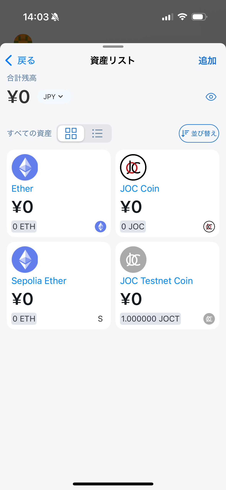
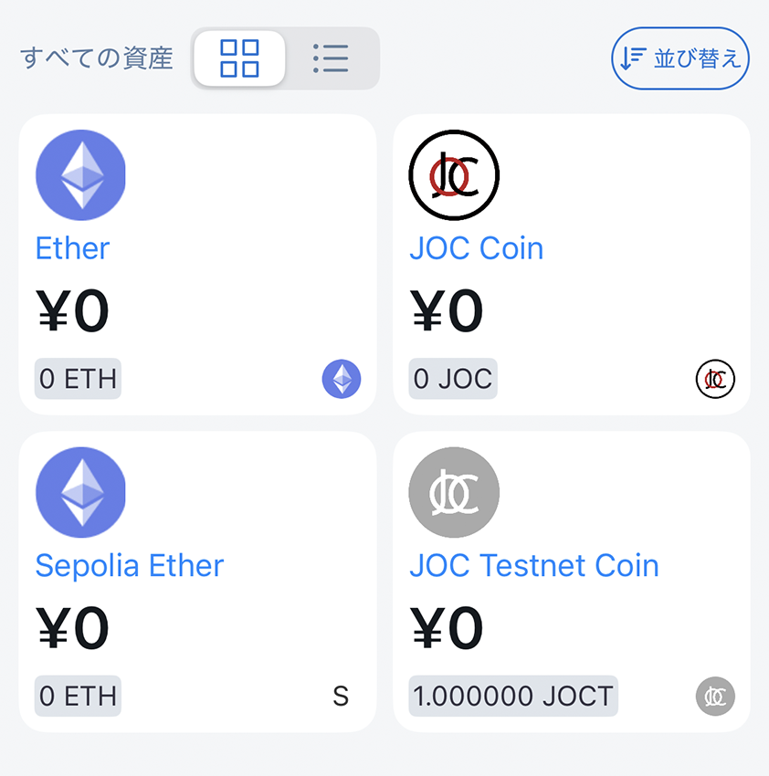
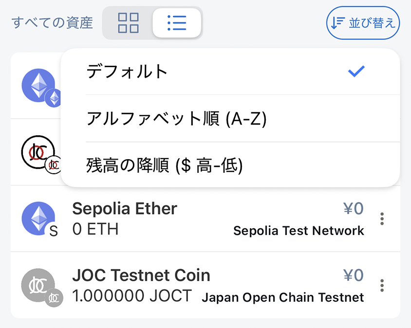
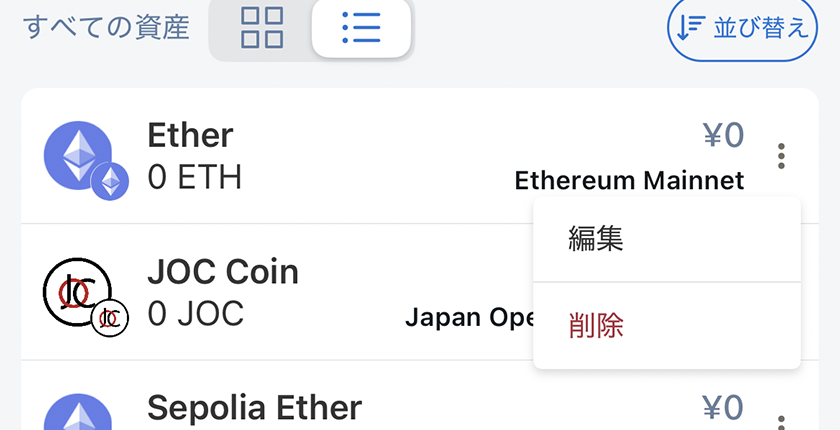
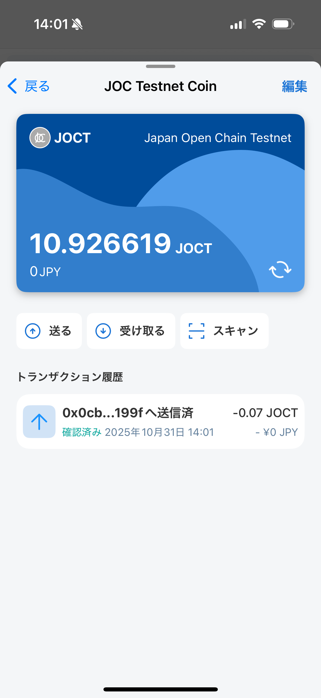
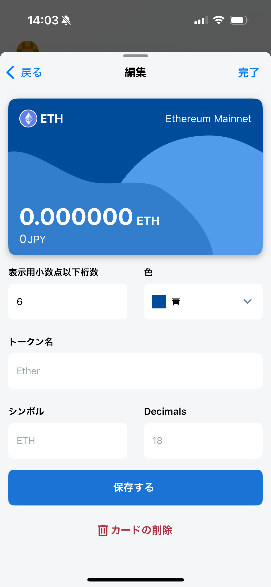

# アセット一覧

選択中のアカウントとネットワークにあるトークンと残高を表示します。

## 総残高

ウォレット設定で選んだ法定通貨による推定合計額です。価格情報は遅延・欠落する場合があり、実際の売却価格を保証するものではありません。

## すべてのアセット

カード形式または一覧形式を選べます。

カード形式：

一覧形式：

次の順で並べ替えられます。

- デフォルト：最近表示したトークンを上に表示
- アルファベット順（A-Z）
- 残高：推定法定通貨額の高い順

トークンの表示設定を編集したり、一覧から削除したりできます。一覧から削除しても、ブロックチェーン上のトークンが移動・消失することはなく、後から再追加できます。

## トークン詳細

トークンをタップすると、次の情報を確認できます。

- トークン名
- トークンシンボル
- トークン残高
- 対応する法定通貨価値
- トークンネットワーク
- 取引履歴

**送信**、**受信**、**スキャンして送信**も選べます。

- 送信
- 受信
- スキャンして送信

## トークンを編集

次の項目を変更できます。

- 表示用の小数点以下桁数
- カードカラー

> **注意:** 表示用の小数点以下桁数を変えると、数量の見え方が変わります。変更前に、トークン発行元の公式情報で正しい桁数を確認してください。
