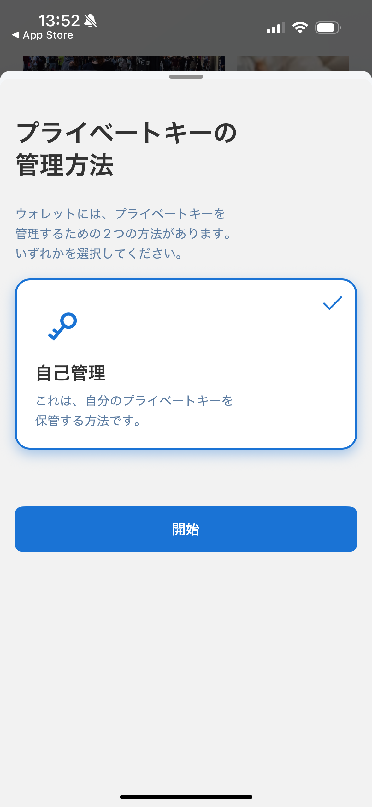
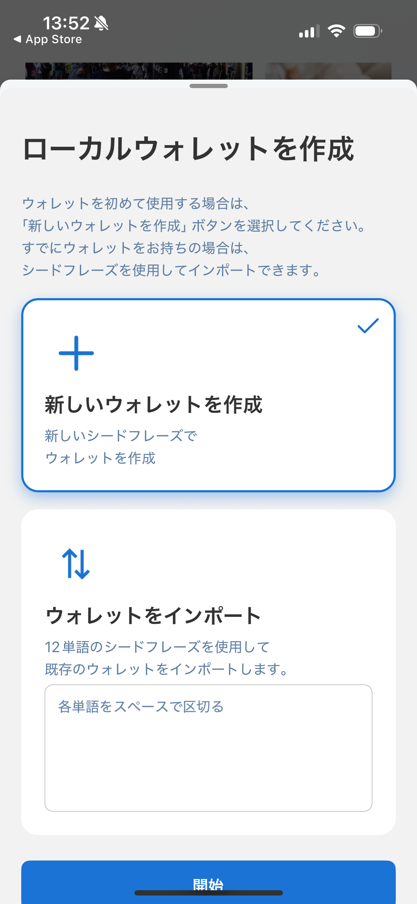
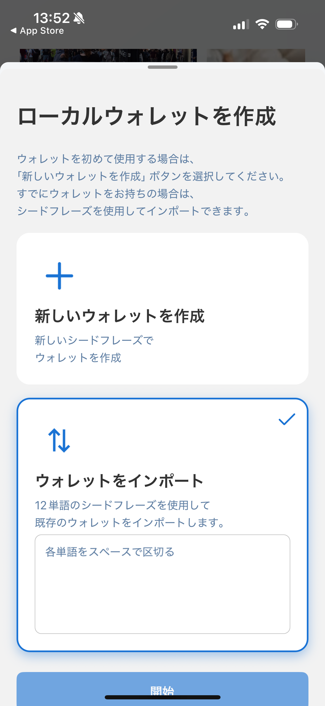

---
navigation:
  title: "ウォレット作成"
---

# ウォレットを作成・インポートする

新しいセルフカストディ型ウォレットを作成するか、既存のウォレットをリカバリーフレーズからインポートできます。ウォレットパスワードは8〜64文字で設定します。

## 始める前に

- 推測されにくく、ほかで使っていないパスワードを用意します。
- リカバリーフレーズを表示・入力するときは、周囲から画面が見えないことを確認します。
- リカバリーフレーズをオフラインで記録する安全な場所を用意します。メール、チャット、保護されていないスクリーンショットには保存しないでください。

Lunascapeはセルフカストディ方式を採用しています。ウォレットの機密情報は端末の保護された認証情報領域に保存されますが、復元用のバックアップは利用者自身で管理する必要があります。

## 新しいウォレットを作成する

1. **新しいウォレットを作成**を選びます。
2. ウォレットパスワードを作成して確認します。
3. リカバリーフレーズを正しい順番で記録し、オフラインで保管します。
4. リカバリーフレーズの確認を完了します。

## 既存のウォレットをインポートする

1. **ウォレットをインポート**を選びます。
2. リカバリーフレーズを正しい順番で入力します。
3. この端末で使うウォレットパスワードを作成して確認します。
4. 送受信する前に、復元されたアカウントとネットワークを確認します。

設定後はEthereum Mainnetが初期ネットワークとして選ばれます。

> **重要:** リカバリーフレーズを知っている人は、ウォレットを操作できます。Lunascapeのサポートがフレーズを尋ねることはありません。端末内のデータとリカバリーフレーズの両方を失うと、資産へ永久にアクセスできなくなる可能性があります。
