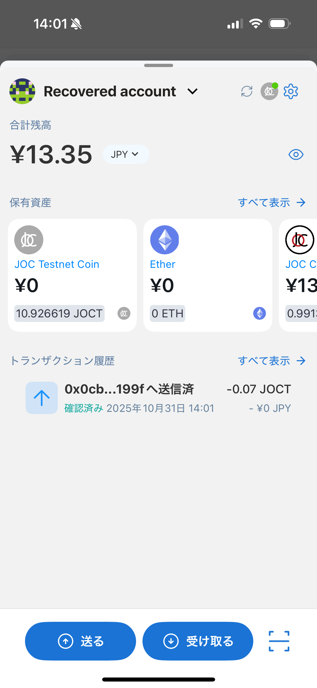
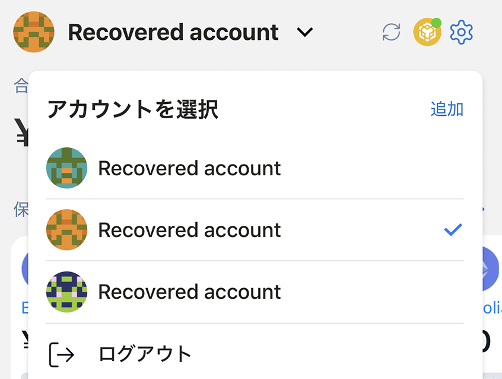
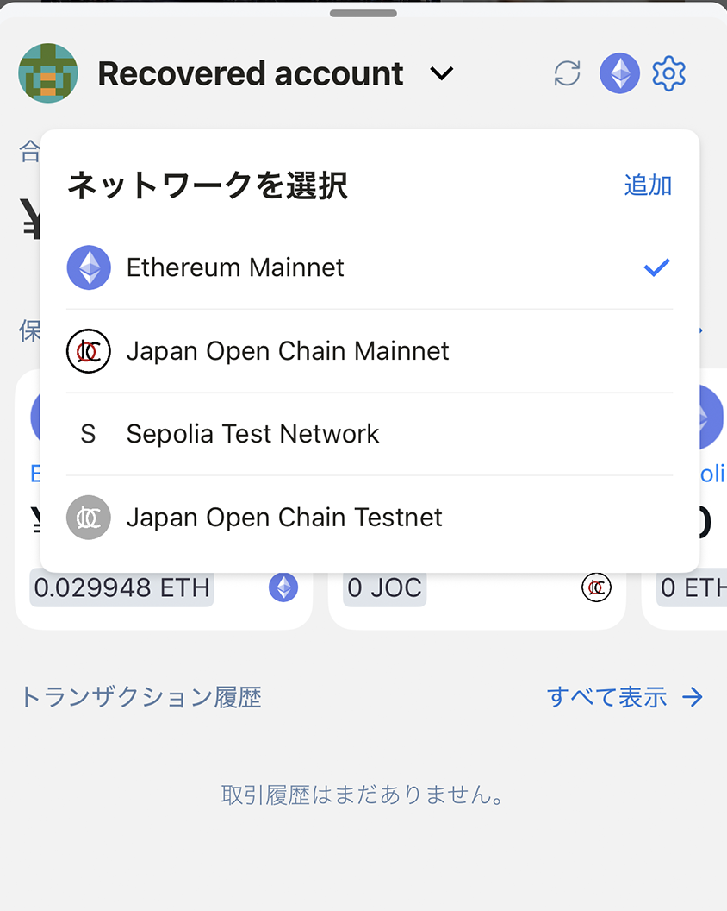
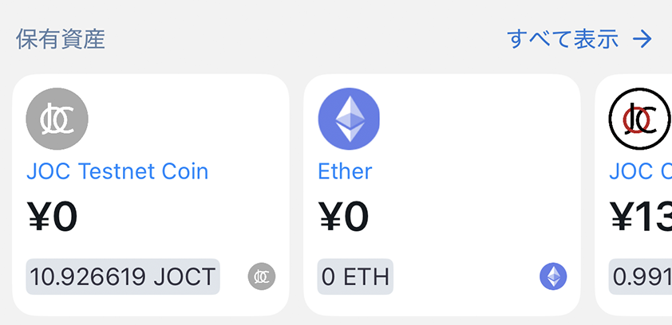
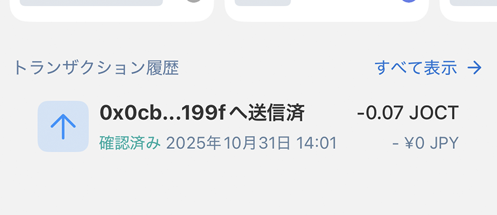
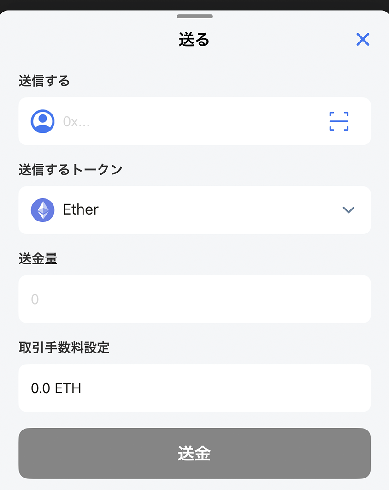
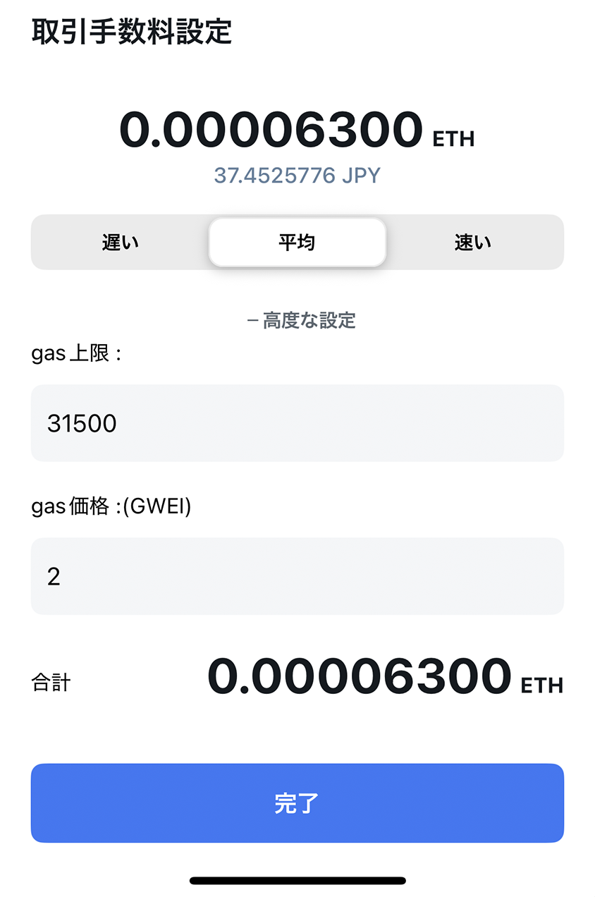
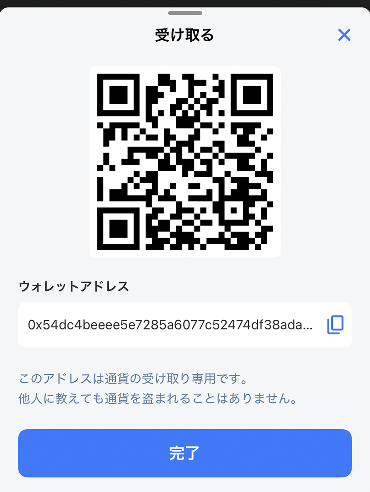
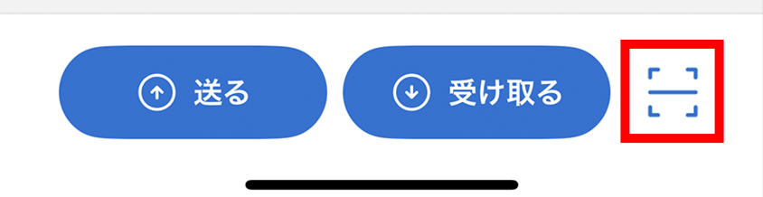

# ウォレットダッシュボード

選択中のアカウント、ネットワーク、推定残高、アセット、最近の送信取引をまとめて確認できます。

## アカウントを切り替える・ロックする

上部のアカウント名をタップすると、アカウントの切り替え・追加、ウォレットのロックができます。

## ネットワーク

右上のネットワークアイコンをタップすると、ネットワークの切り替え・追加ができます。選択したネットワークによって、表示する資産や利用できるDAppが変わります。

## 総残高

ウォレット設定で選んだ法定通貨による推定合計額を表示します。表示切り替えボタンで金額を隠すことができます。

## アセット

初期状態では、最近使ったトークンが上に表示されます。[アセット一覧](asset-list.md)では、表示するトークンを管理できます。

## 取引履歴

選択中のアカウントから送信した最近の取引を表示します。受信取引はこの一覧に含まれないため、完全なオンチェーン履歴が必要な場合は信頼できるブロックエクスプローラーで確認してください。

## アセットを送信する

1. 画面下部の**送信**をタップします。
2. トークンを選び、送信先アドレスを入力またはスキャンします。アドレス帳からも選べます。
3. 数量を入力します。
4. ネットワーク、送信先、トークン、数量、手数料を確認します。
5. ウォレットパスワード、または有効にした生体認証で確定します。

手数料は**低速**、**平均**、**高速**から選べます。ネットワーク手数料を理解している場合は、詳細設定で指定できます。

## アセットを受信する

1. 正しいアカウントとネットワークを選びます。
2. **受信**をタップします。
3. アドレスをコピーするか、相手にQRコードを提示します。
4. 相手が同じ互換ネットワークを使うことを確認します。

## QRコードをスキャンする

画面下部のQRアイコンをタップすると、送信先アドレスやWalletConnectの接続コードを読み取れます。続行前に、読み取られた操作内容を確認してください。

> **重要:** ブロックチェーン上の取引は通常取り消せません。初めて使うアドレスやネットワークでは少額でテストし、アドレス帳の名前だけを信用しないでください。
