---
navigation:
  title: "ウォレット操作"
---

# DAppでのウォレット操作

DAppからLunascapeへ送られる接続、署名、取引などの要求について説明します。承認前に、必ず確認画面を読んでください。

> **重要:** ウォレットを接続すると、アカウント情報がWebサイトへ伝わります。署名は権限を与える場合があり、取引は資産を移動させる場合があります。DAppのURL、アカウント、ネットワーク、要求内容、手数料を確認し、理解できない要求は拒否してください。

## ウォレットを接続

1. DAppを開き、ウォレット接続ボタンをタップします。
2. ウォレット一覧から**Lunascape**を選びます。
3. LunascapeでDAppのドメイン、アカウント、接続要求を確認します。
4. 内容が正しい場合だけ承認します。

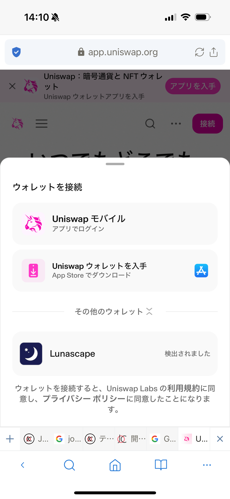

Lunascapeが一覧にない場合、DAppがMetaMask互換プロバイダーだけを検出している可能性があります。[ウォレット設定](wallet-settings.md#ethereumismetamaskを有効にする)で**ethereum.isMetaMask**を有効にし、DApp側でMetaMaskを選んでください。

## トークンを追加

トークンは手動で追加するか、DAppからの追加要求を承認できます。

### 手動でトークンを追加する

1. アセット一覧で**追加**をタップします。
2. トークンの種類を選びます。

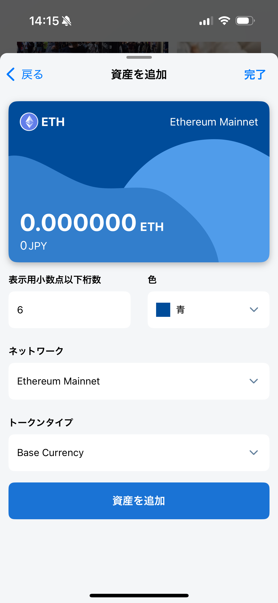

**ベース通貨**の場合は、ネットワークを選んで、そのネットワークのネイティブトークンを追加します。

**ERC-20**の場合は、対応するEVMネットワークを選び、コントラクトアドレスを入力またはスキャンします。トークン名、シンボル、小数点以下桁数が取得されます。

3. トークン発行元の公式情報でコントラクトアドレスを確認し、選択中のネットワーク用であることを確かめます。同じ名称のトークンでも、ネットワークごとにアドレスが異なる場合があります。
4. 取得されたトークン名、シンボル、小数点以下桁数を確認します。
5. **アセットを追加**をタップします。

> **注意:** トークン名やシンボルは偽装できます。名称、ロゴ、知らない相手から届いたアドレスだけを根拠に追加しないでください。

### DAppからトークンを追加する

DAppはトークンの追加を要求できます。次の画面はCoinMarketCapを使った例です。現在のURLとコントラクト情報は、必ず別途確認してください。

1. Lunascapeで選択中のネットワークに対応するコントラクトアドレスを探します。
2. Webサイトが表示するウォレット／トークン追加アイコンをタップします。

3. 接続要求が表示されたら、ドメインとアカウントを確認してから承認します。

4. トークン追加要求に表示されたトークンとネットワークを確認します。

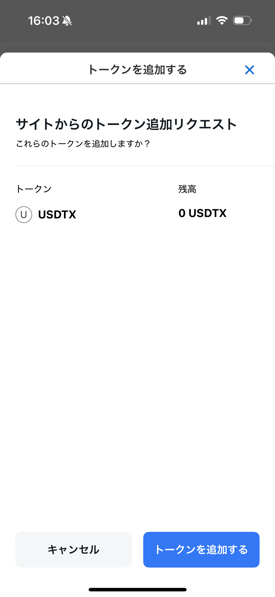

5. 公式情報と一致している場合だけ**トークンを追加**をタップします。

## ネットワークを追加

ネットワークは、**ウォレット設定** > **ネットワーク** > **ネットワークを追加**から手動で追加できます。詳しくは[ウォレット設定](wallet-settings.md#ネットワーク)を参照してください。

### DAppからネットワークを追加する

DAppが未登録のネットワークを要求すると、Lunascapeに追加確認が表示されます。承認前に、ネットワーク名、RPC URL、チェーンID、通貨シンボル、ブロックエクスプローラーを確認してください。

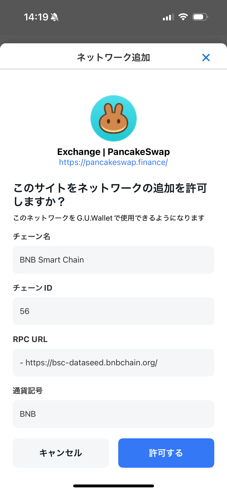

ネットワークを追加すると、そのネットワークのネイティブトークンも追加されます。

## ネットワークを切り替え

DAppが別のネットワークを要求すると、Lunascapeに切り替え確認が表示されます。

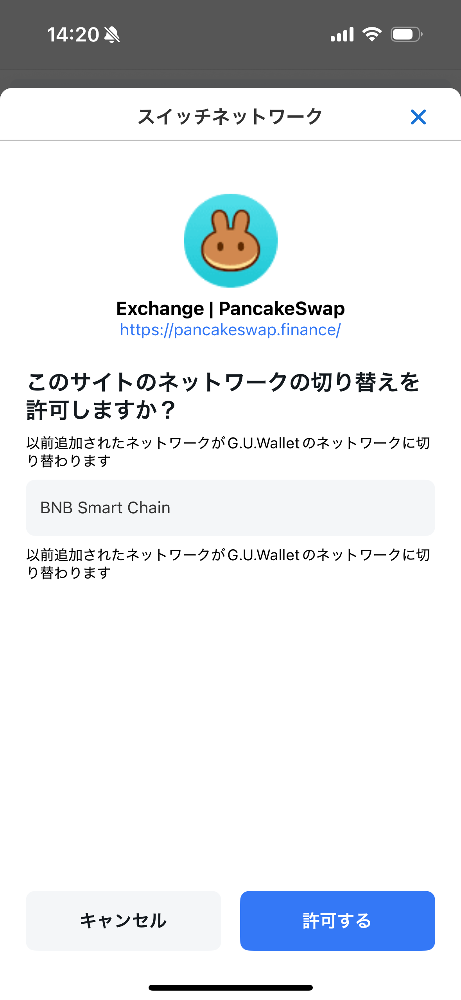

ウォレット側で切り替えた場合、接続中のDAppも同じネットワークへ切り替わり、追加の確認は表示されません。

ネットワークが登録済みでも、そのネイティブトークンをアセット一覧から削除している場合は、トークンの追加確認後にネットワークの切り替え確認が表示されます。

## メッセージに署名する

DAppによっては、ログインや操作の承認にウォレット署名を使います。署名は必ずしもブロックチェーン取引ではありませんが、権限を与える場合があります。

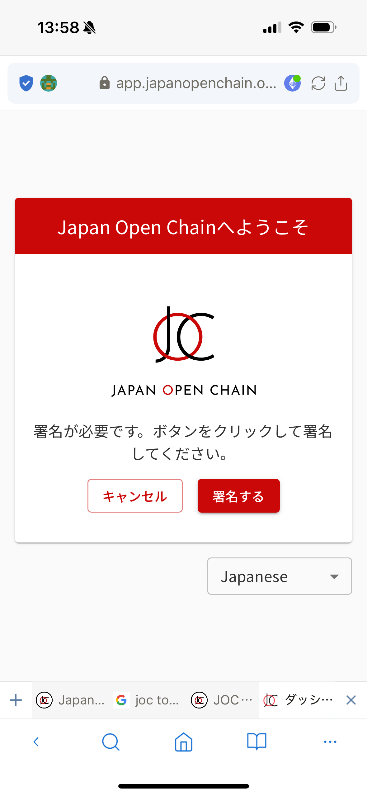

DAppで**署名**を選ぶと、Lunascapeにメッセージと要求元サイトが表示されます。

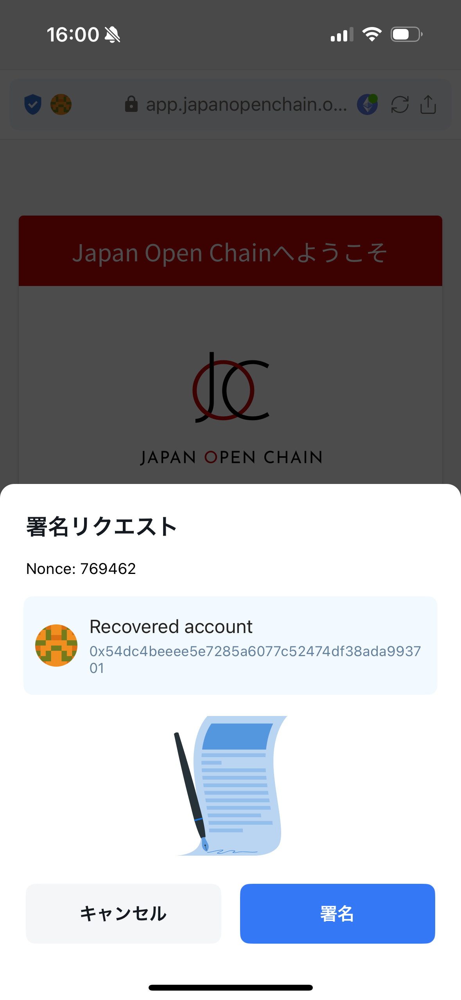

承認する場合はウォレットパスワードを入力します。

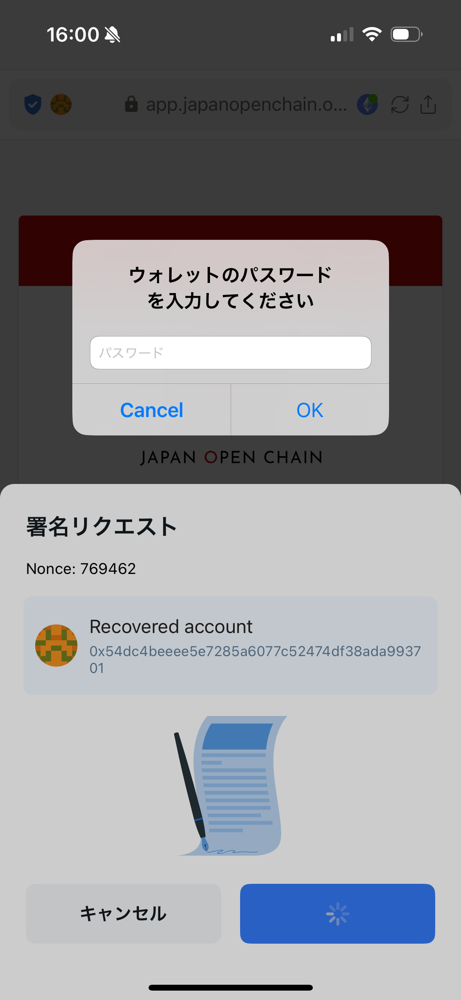

LunascapeはPersonal Sign、Sign Typed Data、Sign Typed Data V3、Sign Typed Data V4に対応しています。

> **警告:** 内容を読めない署名や、予期していない署名は承認しないでください。送金額が表示されていなくても、悪意ある署名が資産へのアクセスを許可する場合があります。

## 取引を送信

DAppが送金やコントラクト操作を要求すると、Lunascapeに取引確認が表示されます。

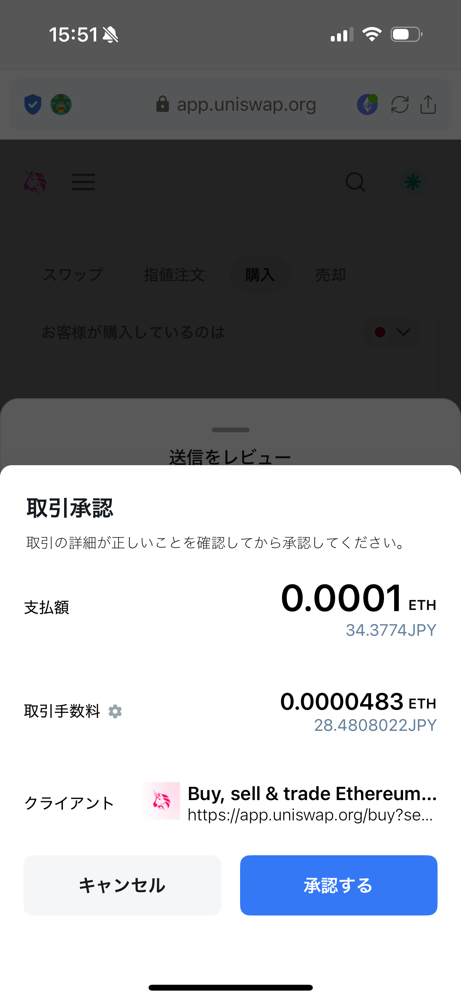

スワップの場合も取引確認が表示されます。

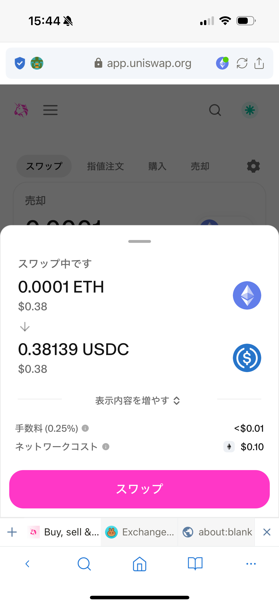

承認前に、ネットワーク、送信先またはコントラクト、数量、トークン承認、手数料を確認してください。手数料は**低速**、**平均**、**高速**から選べ、初期状態では**平均**です。上級者は詳細設定で手動指定できます。

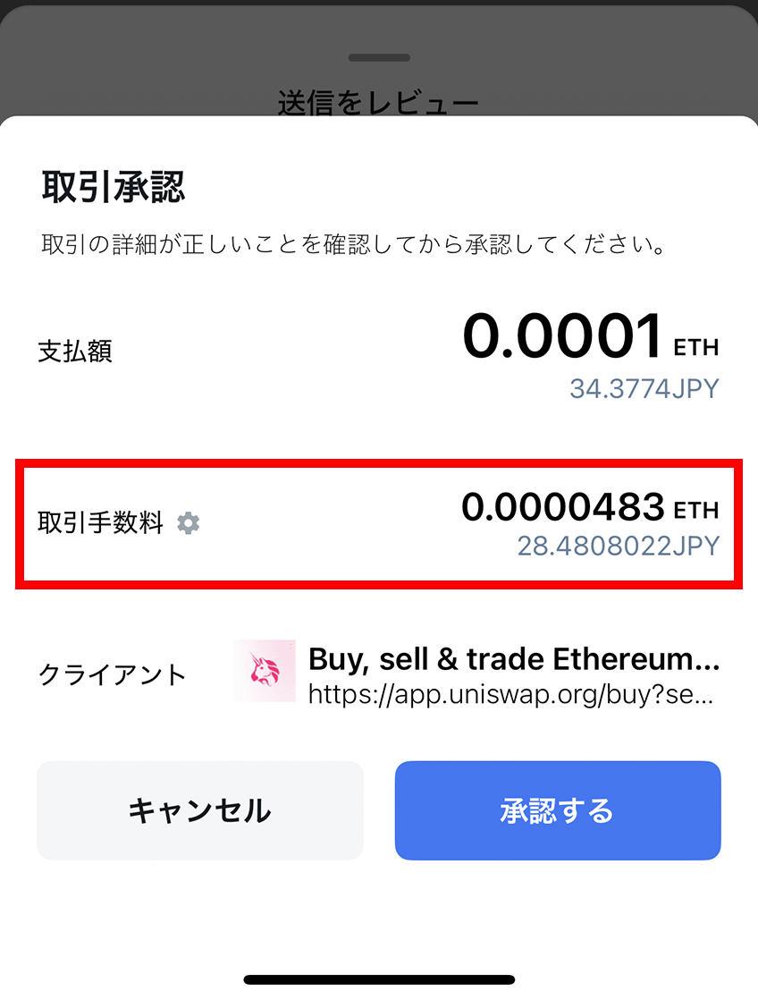

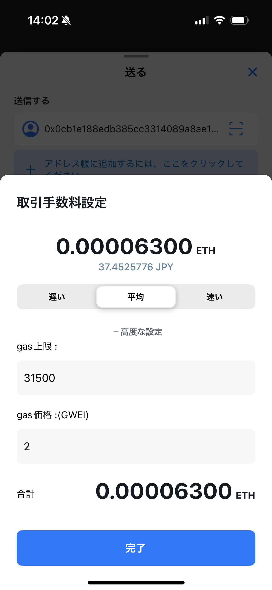

> **重要:** 確定したブロックチェーン取引は通常キャンセル・取り消しできません。詳細設定で不適切な手数料を指定すると、取引が遅延または失敗する場合があります。
