# ウォレット設定

アカウント、保存済みアドレス、ネットワーク、表示通貨、接続、セキュリティを管理します。

> **重要:** アカウントの削除、ウォレットの置き換え、マスターパスワードの変更を行う前に、リカバリーフレーズと個別にインポートした秘密鍵をバックアップしてください。

## アカウント

既存のアカウントと、現在選択中のアカウントを表示します。

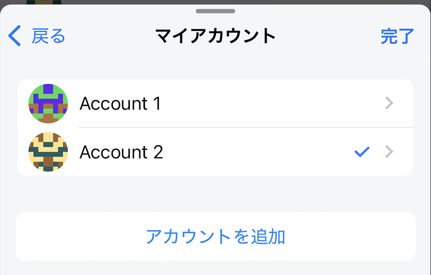

アカウントは次の2つの方法で追加できます。

- **アカウントを作成**：現在のリカバリーフレーズから別のアカウントを生成します。
- **秘密鍵をインポート**：別に管理されている秘密鍵からアカウントを追加します。

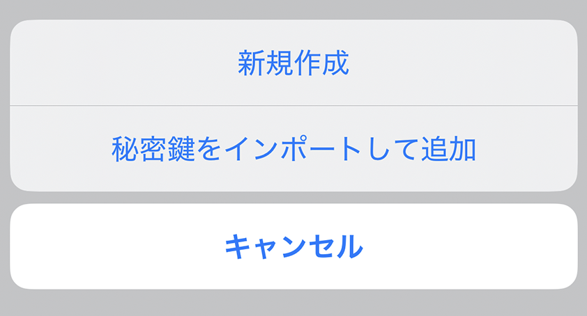

### アカウント詳細

アカウント名、アドレス、秘密鍵を表示します。編集できるのはアカウント名だけです。アドレスと秘密鍵はコピーでき、アカウントの削除もできます。

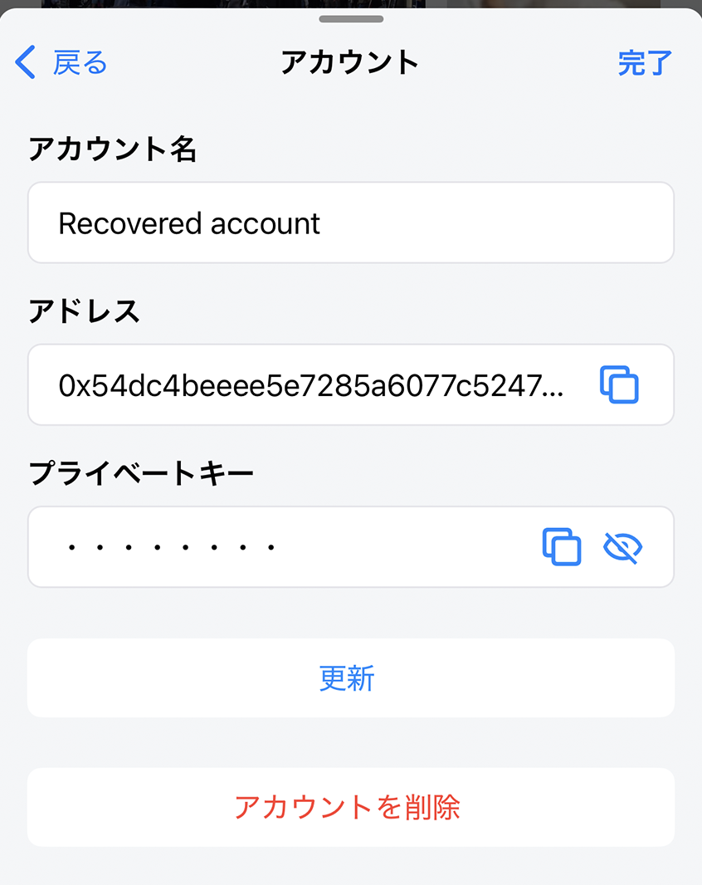

> **警告:** 秘密鍵を知っている人は、そのアカウントを完全に操作できます。必要な場合以外はコピーせず、Webサイト、メッセージ、サポート依頼へ貼り付けないでください。秘密鍵をバックアップせずにインポート済みアカウントを削除すると、永久にアクセスできなくなる場合があります。

## アドレス帳

よく使うアドレスに名前と説明を付けて保存します。

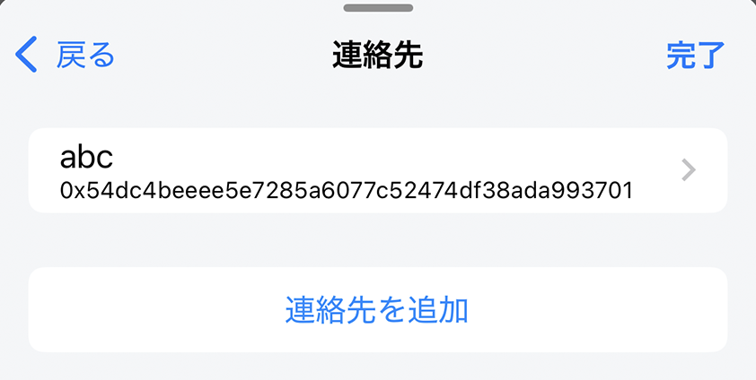

**連絡先を追加**

次の項目を入力します。

- 名前
- アドレス
- 説明：連絡先の詳細な説明を追加

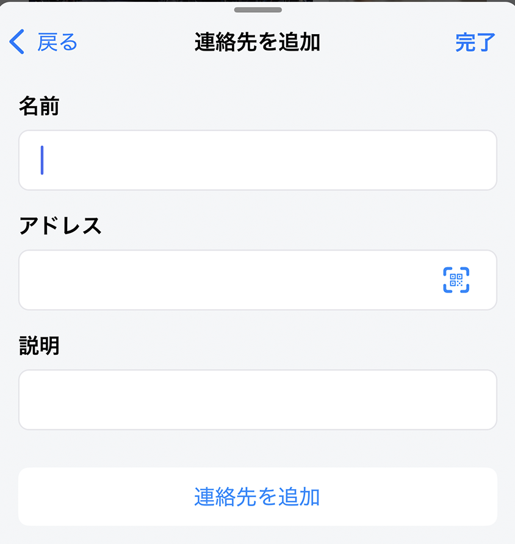

> **注意:** 保存した名前は、現在もそのアドレスが正しいことや、意図した相手のものであることを保証しません。送金ごとに完全なアドレスとネットワークを確認してください。

## ネットワーク

設定済みのネットワークと、現在選択中のネットワークを表示します。

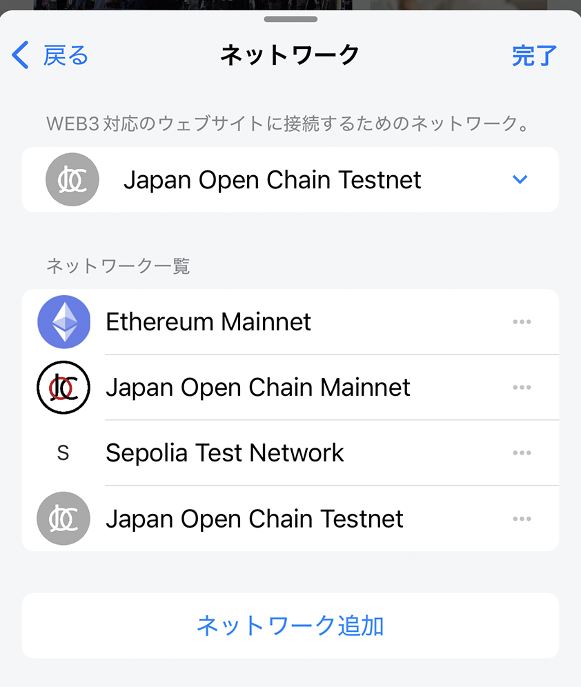

ネットワークの選択、追加、編集ができます。

### ネットワークを追加する

ネットワークの公式ドキュメントで次の情報を確認します。

- ネットワーク名（必須）
- RPC URL（必須）
- チェーンID（必須。RPC URLから自動取得される場合があります）
- ネイティブトークンのシンボル（必須）
- ネイティブトークン名（必須）
- ブロックエクスプローラーURL（任意）

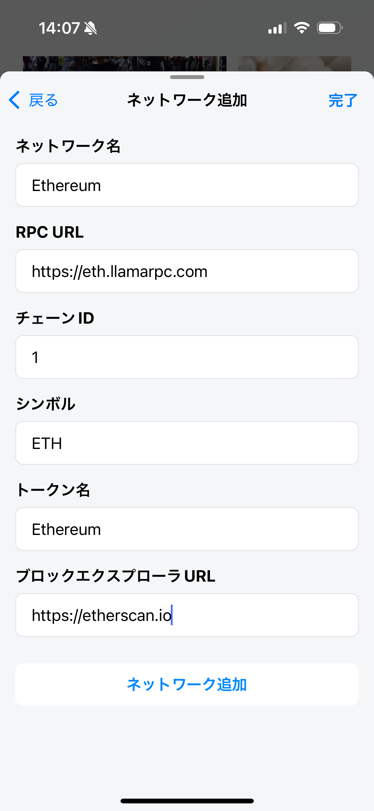

追加済みネットワークでは、ブロックエクスプローラーURLだけを編集できます。

> **警告:** 悪意あるRPCは、誤ったブロックチェーン情報を返したり、利用状況を追跡したりする可能性があります。RPC URLとチェーンIDをネットワークの公式ドキュメントで確認してください。

## 通貨変換

推定残高の表示に使う法定通貨を選びます。

利用できる通貨：

- USD
- JPY
- EUR
- GBP
- AUD
- CAD
- HKD
- KRW
- SGD

法定通貨への換算額は推定値で、遅延・欠落する場合があります。

## WalletConnect

現在のWalletConnectセッションを表示します。**新しい接続**をタップしてDAppのQRコードを読み取れます。ホーム画面またはウォレットダッシュボードからスキャナーを開くこともできます。

セッションを削除すると、そのDAppとの接続が切断されます。使わなくなった接続や、覚えのない接続は削除してください。

## 許可されたWebサイト

ウォレットへの接続を許可したWebサイトを、アカウントごとに表示します。

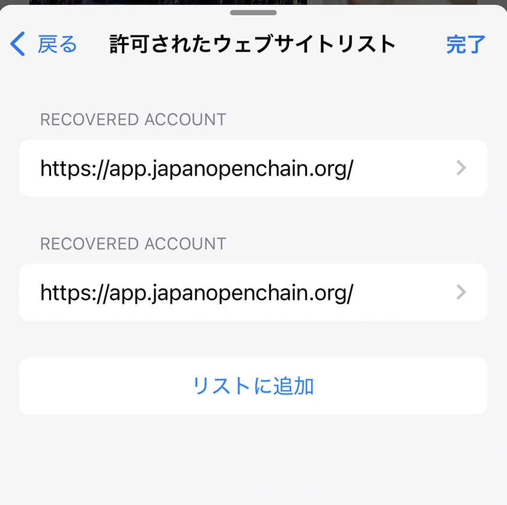

DAppへの接続を承認すると、そのURLが一覧へ追加されます。次回以降は、接続確認なしで許可済みアカウントへ再接続できます。使わないサイトや信頼できないサイトは削除してください。**リストに追加**から手動登録もできます。

> **重要:** 接続許可だけで署名や取引が自動承認されるわけではありませんが、アカウントのアドレスがサイトへ伝わり、要求を送れる状態になります。許可前に、スペルを含む完全なドメインを確認してください。

## シードフレーズをエクスポート

バックアップ用にウォレットのリカバリーフレーズを表示します。

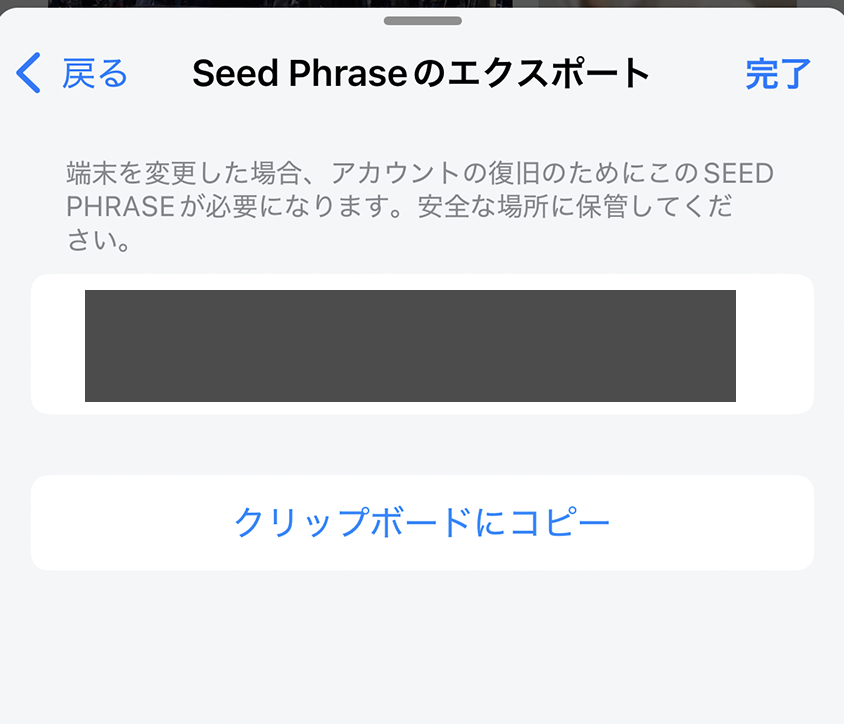

> **危険:** リカバリーフレーズを見た人はウォレットの資産を操作できます。人目のない場所で表示し、正しい順序でオフラインに記録してください。Lunascapeのサポートを含む第三者へ共有したり、Webサイトへ入力したりしないでください。

## マスターパスワードを変更

マスターパスワードを変更すると、入力したリカバリーフレーズからウォレットが再作成されます。現在のウォレットに新しいパスワードを設定する場合と、別のウォレットへ置き換える場合に使います。

### 現在のウォレットのパスワードをリセットする

生体認証でまだ開ける場合は、最初に現在のリカバリーフレーズと、個別にインポートした秘密鍵を安全にバックアップします。そのリカバリーフレーズを入力し、新しいパスワードを設定します。

- 現在のアカウント一覧、表示トークン、カスタムネットワーク、端末内の取引履歴は削除され、再構築されます。
- **アカウントを作成**で追加したアカウントは、同じリカバリーフレーズから再生成できます。
- **秘密鍵をインポート**で追加したアカウントは、そのフレーズに含まれません。秘密鍵を個別にバックアップしてください。

### ウォレットを置き換える

別のリカバリーフレーズを入力すると、現在のウォレットが置き換わり、新しいパスワードが設定されます。続行前に、現在のリカバリーフレーズ、インポートした秘密鍵、アドレス、カスタムネットワーク情報を保存してください。

> **危険:** この操作では現在の端末内ウォレットデータが削除されます。必要なバックアップが完全で、読み取れることを確認するまで実行しないでください。

## Face ID / Touch IDでロック解除（iOSのみ）

Face IDまたはTouch IDでウォレットを開けるようにします。有効にしても、ウォレットパスワードとリカバリーフレーズの安全なバックアップを維持してください。

## Face ID / Touch IDで取引を送信（iOSのみ）

取引ごとのパスワード入力の代わりに、Face IDまたはTouch IDで確定できるようにします。認証前に取引内容を必ず確認してください。

## ethereum.isMetaMaskを有効にする

**初期値:** 無効

MetaMask互換ウォレットの検出に使われるプロバイダーフラグで、Lunascapeを識別させる互換設定です。

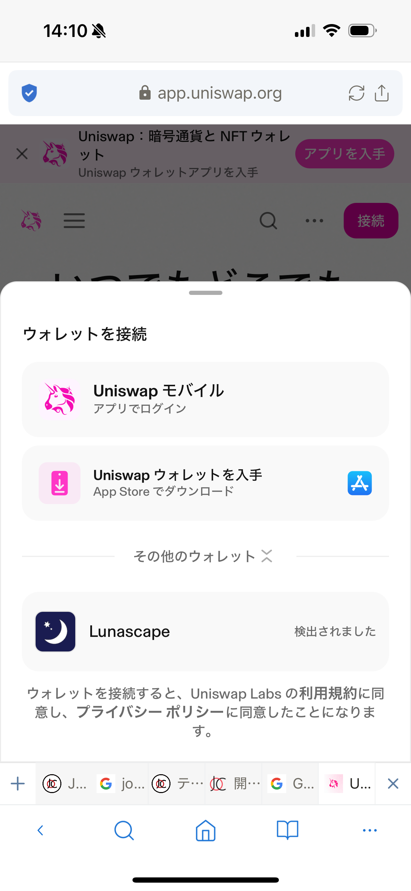

一部のDAppではLunascapeが直接一覧に表示されず、MetaMaskだけが選択肢に表示されることがあります。

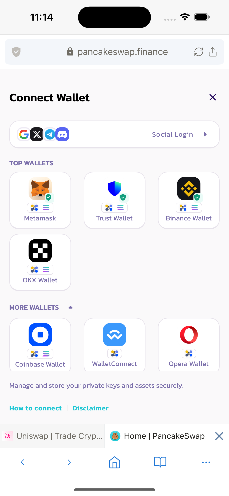

その場合はこの設定を有効にし、DApp側でMetaMaskを選びます。接続と承認の画面は引き続きLunascapeが表示します。

> **注意:** この設定が変えるのは互換性のための検出方法だけです。MetaMaskがインストールされたり、ウォレットが移動したり、信頼できないDAppが安全になったりするものではありません。
