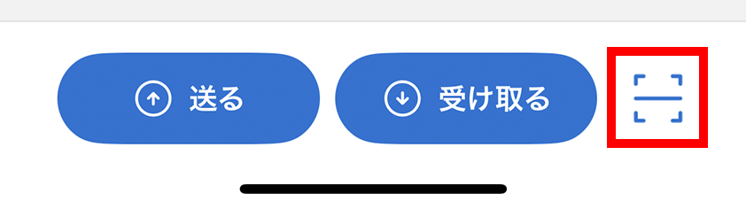
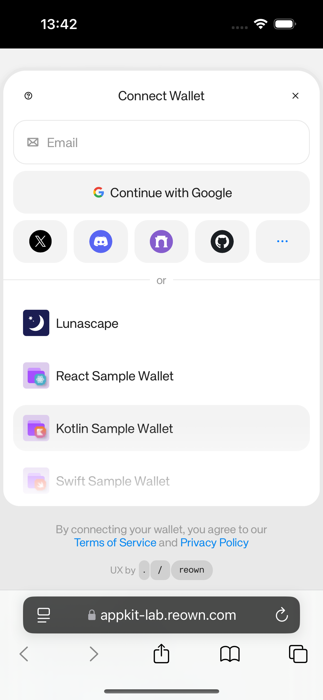
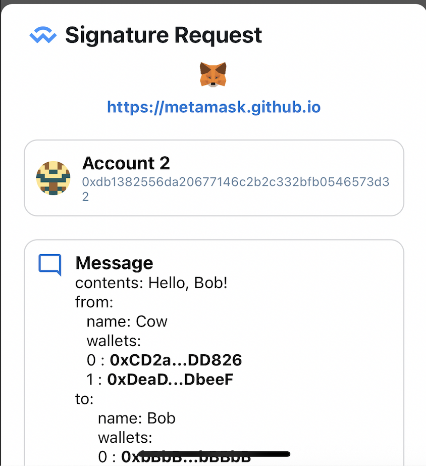

# WalletConnect

WalletConnectは、QRコードまたはディープリンクを使い、ウォレットとDAppの間で接続、署名、取引の要求をやり取りするオープンプロトコルです。DAppに秘密鍵は渡りませんが、要求内容は利用者自身で確認する必要があります。

プロトコルの詳細は、[WalletConnect公式サイト](https://walletconnect.network/)を参照してください。

LunascapeはQRコードとディープリンクによるWalletConnect接続に対応しています。

> **重要:** WalletConnectのコードには、信頼できないサイトからの要求が含まれる場合があります。接続前にDAppのドメイン、要求されたアカウント、ネットワークを確認してください。WalletConnect接続のためにリカバリーフレーズや秘密鍵を入力することはありません。

## QRコードで接続する

1. DAppで**WalletConnect**を選びます。接続用QRコードが表示されます。

2. Lunascapeのホーム画面でQRスキャナーをタップします。

   または、ウォレットダッシュボードのQRスキャナーをタップします。

3. QRコードを読み取ります。
4. DApp名とドメイン、アカウント、ネットワーク、要求された権限を確認します。
5. 接続を確定します。

## ディープリンクで接続する

1. DAppのウォレット一覧で**Lunascape**を選びます。

2. Lunascapeを開く確認が表示されたら、**開く**をタップします。

3. Lunascapeで要求内容を確認し、接続を確定します。

## WalletConnectセッション

接続が完了するとセッションが作成されます。**ウォレット** > **設定** > **WalletConnect**で現在のセッションを確認できます。

セッションを削除するとDAppとの接続が切れます。DApp側で切断した場合も、Lunascapeのセッション一覧から削除されます。

> **ヒント:** 使わなくなったセッションや、覚えのないセッションは削除してください。

## メッセージに署名する

Lunascapeでは、次の署名方式による要求を表示できます。

- Personal Sign

- Sign Typed Data

- Sign Typed Data V3

- Sign Typed Data V4

> **警告:** 署名によってアカウントへのアクセスやトークン操作が許可される場合があります。予期していない要求や、内容を理解できないメッセージは拒否してください。

## 取引を確定する

DAppから取引が要求されると、Lunascapeに確認画面が表示されます。承認前にネットワーク、送信先またはコントラクト、数量、トークン権限、手数料を確認してください。

> **重要:** 確定したブロックチェーン取引は通常キャンセル・取り消しできません。

## ネットワークを切り替え

DAppが別のネットワークを要求すると、Lunascapeに切り替え確認が表示されます。意図した操作と一致しない場合は拒否してください。

