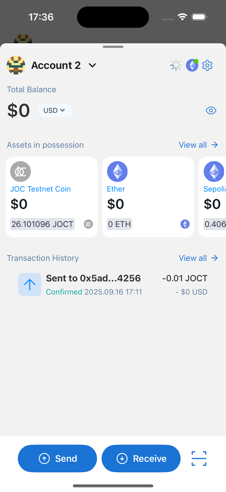
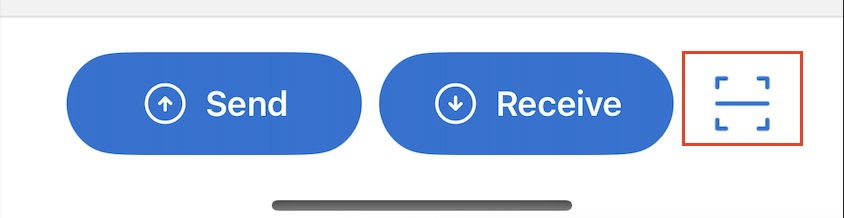

---
navigation:
  order: 300
---

# Wallet Dashboard

The Dashboard summarizes the selected account, network, estimated balance, assets, and recent outgoing transactions.

## Switch or lock the account

Tap the account name at the top to switch accounts, add an account, or lock the wallet.

## Switch networks

Tap the network icon at the top right to switch or add a network. The selected network determines which assets and DApps are available.

## Total Balance

The estimated account total appears in the fiat currency selected in Wallet Settings. Tap the visibility control to hide or show the value.

## Assets

Recently used tokens appear first by default. Open the [Asset List](asset-list.md) to see and manage all displayed tokens.

## Transaction History

The latest outgoing transactions for the selected account are shown. Incoming transactions are not included in this list; use a trusted block explorer when you need complete on-chain history.

## Send assets

1. Tap **Send** in the footer.
2. Select the token and enter or scan the recipient address. You can also choose a saved Address Book entry.
3. Enter the amount.
4. Review the network, recipient, token, amount, and fee.
5. Confirm with the wallet password or enabled biometric authentication.

Choose **Slow**, **Average**, or **Fast** for the transaction fee, or use the advanced settings when you understand the network's fee rules.

## Receive assets

1. Select the correct account and network.
2. Tap **Receive**.
3. Copy the address or show its QR code to the sender.
4. Confirm that the sender will use the same compatible network.

## Scan a QR code

Tap the QR icon in the footer to scan a recipient address or a WalletConnect connection code. Check the recognized action before continuing.

> **Important:** Blockchain transactions are usually irreversible. Send a small test amount when using a new address or network, and never rely on the address label alone.
