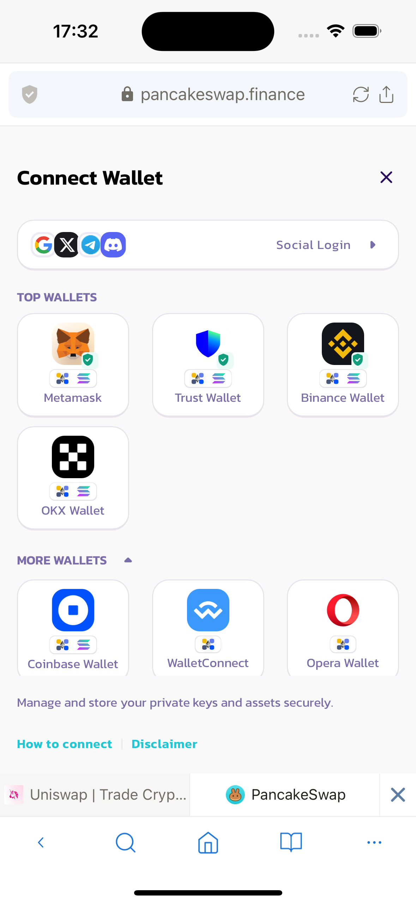
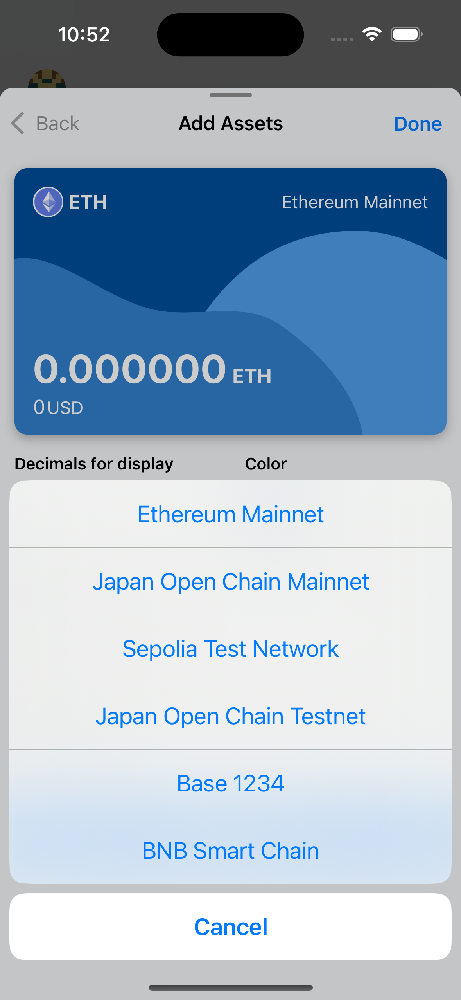
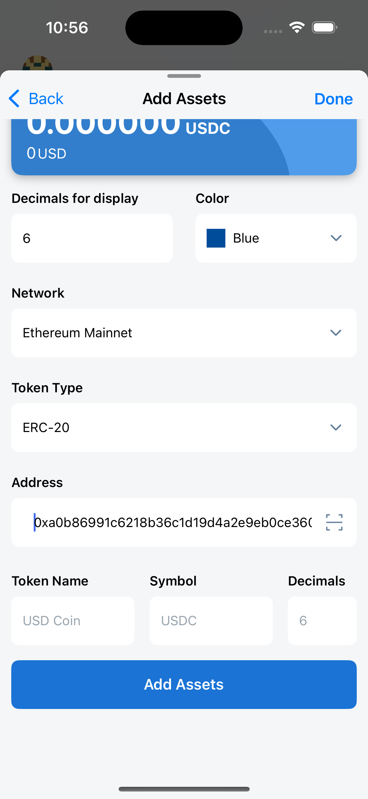

---
navigation:
  title: "Wallet Operations"
  order: 700
---

# Wallet operations with DApps

This page explains requests a DApp can send to Lunascape. Read every confirmation screen before approving it.

> **Important:** Connecting a wallet identifies your account to the site. Signing a message can authorize actions, and sending a transaction can move assets. Verify the DApp URL, selected account, network, request details, and fee. Reject anything you do not understand.

## Connect Wallet

1. Open the DApp and select its wallet connection button.
2. Select **Lunascape** from the wallet list.
3. In Lunascape, verify the DApp domain, account, and requested connection.
4. Approve the request only if the details are correct.

If Lunascape is not listed, the DApp may only detect wallets that identify through the MetaMask-compatible provider. Enable **ethereum.isMetaMask** in [Wallet Settings](wallet-settings.md#enable-ethereumismetamask), then select the MetaMask option in the DApp.

## Add a token

You can add a token manually or accept an add-token request from a DApp.

### Add a token manually

1. On the Asset List screen, tap **Add**.
2. Select the token type.

For **Base Currency**, select the network to add its native token.

For **ERC-20**, select the matching EVM network and enter or scan the contract address. Lunascape then retrieves the token name, symbol, and decimals.

3. Verify the contract address against the token issuer's official source and make sure it belongs to the selected network. The same token can use different contract addresses on different networks.
4. Check the detected token name, symbol, and decimals.
5. Tap **Add Assets**.

> **Caution:** Token names and symbols are not unique and can be copied by scam tokens. Do not add a token based only on its name, logo, or an address supplied in an unsolicited message.

### Add a token from a DApp

A DApp can request that a token be added. The following screens show one example using CoinMarketCap. Always verify the current site URL and contract information independently.

1. Find the contract address that matches the network selected in Lunascape.
2. Select the wallet/add-token icon presented by the site.

3. If a connection request appears, check the domain and account before approving it.

4. Check the token and network shown in the add-token request.

5. Tap **Add Tokens** only when the details match the official token information.

## Add a network

You can add a network manually from **Wallet Settings** > **Network** > **Add Network**. See [Wallet Settings](wallet-settings.md#network).

### Add a network requested by a DApp

When a DApp requests a network that is not yet available, Lunascape shows a confirmation. Verify the network name, RPC URL, chain ID, currency symbol, and block explorer before approving it.

The network's native token is added at the same time.

## Switch networks

When a DApp requests a different network, Lunascape shows a confirmation before switching.

When you switch networks from the wallet, the connected DApp follows the selected network without an additional DApp confirmation.

If the network exists but its native token was removed from the Asset List, Lunascape first asks to add that token and then asks to switch networks.

## Sign a message

Some DApps use a wallet signature to sign in or authorize an action. A signature is not always a blockchain transaction, but it can still grant permissions.

When you select **Sign** in the DApp, Lunascape displays the message and requesting site for confirmation.

Enter the wallet password to approve the signature.

Lunascape supports Personal Sign, Sign Typed Data, Sign Typed Data V3, and Sign Typed Data V4.

> **Warning:** Do not sign an unreadable or unexpected message. A malicious signature can authorize asset access even when no transfer amount is shown.

## Send a transaction

When a DApp requests a transfer or contract interaction, Lunascape displays a transaction confirmation.

A swap also produces a transaction confirmation.

Before confirming, verify the network, destination or contract, amount, token approval, and total fee. Choose **Slow**, **Average**, or **Fast**; **Average** is selected by default. Advanced Settings lets experienced users enter fee values manually.

> **Important:** A confirmed blockchain transaction usually cannot be canceled or reversed. An incorrect advanced fee can delay or fail a transaction.
