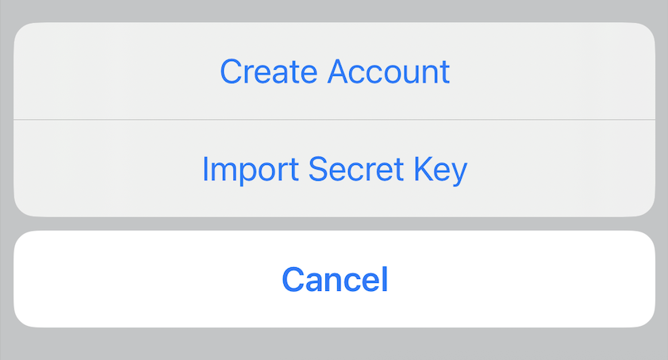
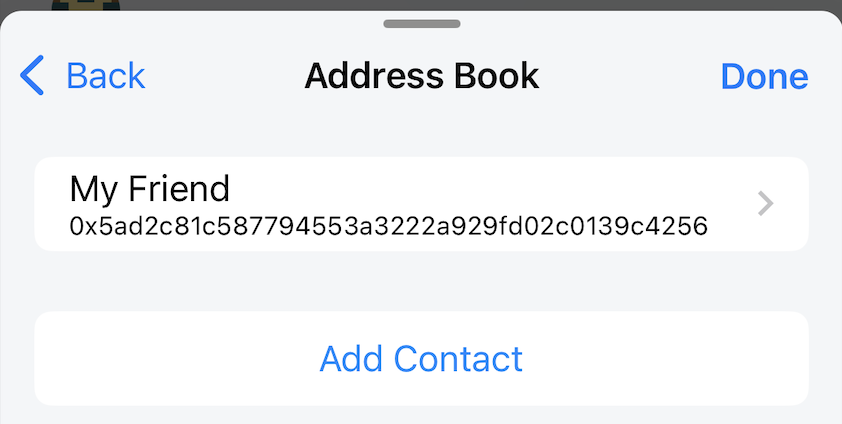
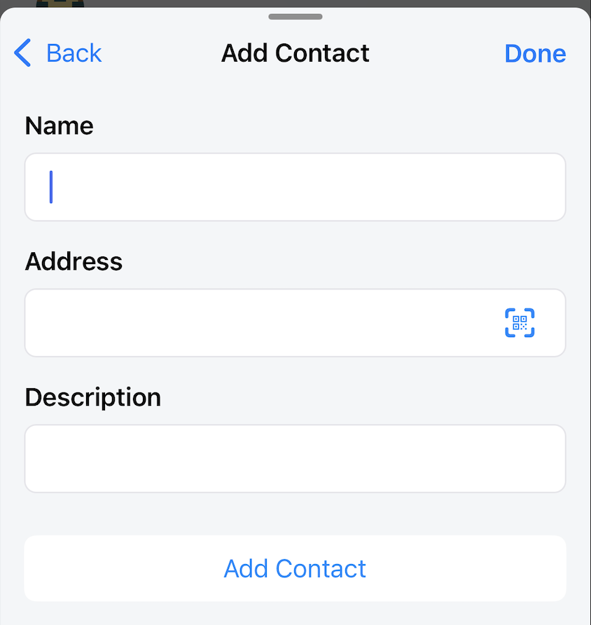
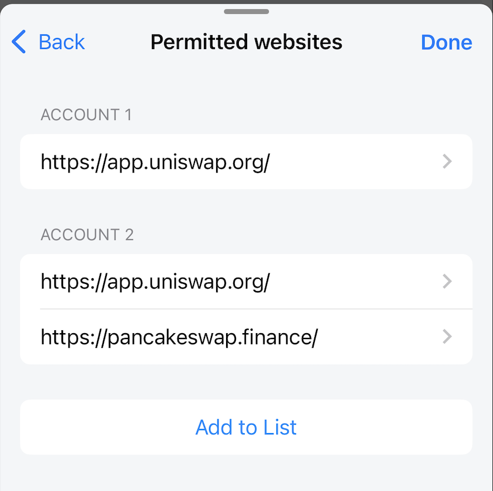

---
navigation:
  order: 500
---

# Wallet Settings

Open Wallet Settings to manage accounts, saved addresses, networks, display currency, connections, and security options.

> **Important:** Back up the recovery phrase and any separately imported private keys before deleting accounts, replacing the wallet, or changing the master password.

## Account

The account list shows existing accounts and the currently selected account.

You can add accounts in two ways:

- **Create Account**: derives another account from the recovery phrase already in use.
- **Import Secret Key**: adds an account from a separate private key.

### Account details

The details screen shows the account name, address, and private key. Only the account name can be edited. The address and private key can be copied, and the account can be deleted.

> **Warning:** A private key gives full control of that account. Do not copy it unless necessary, and never paste it into a website, message, or support request. Deleting an imported account without backing up its private key can permanently remove your access.

## Address Book

The Address Book stores names and notes for frequently used addresses.

**Add Contact**

Enter:

- Name
- Address
- Description: add detailed description for contact

> **Caution:** A saved name does not prove that an address is still correct or belongs to the intended person. Verify the full address and network before every transfer.

## Network

The network list shows configured networks and the currently selected network.

You can select, add, or edit a network.

### Add a network

Obtain the following values from the network's official documentation:

- Network name (required)
- RPC URL (required)
- Chain ID (required; it may be detected from the RPC URL)
- Native-token symbol (required)
- Native-token name (required)
- Block Explorer URL (optional)

For an existing network, only the Block Explorer URL can be edited.

> **Warning:** A malicious RPC endpoint can provide false blockchain data or track activity. Verify the RPC URL and chain ID with the network's official documentation.

## Currency Conversion

Select the fiat currency used for estimated balance values.

Available currencies:

- USD
- JPY
- EUR
- GBP
- AUD
- CAD
- HKD
- KRW
- SGD

Fiat values are estimates and may be delayed or unavailable.

## WalletConnect

This list shows active WalletConnect sessions. Tap **New Connection** to scan a DApp's QR code. You can also start the scanner from the Home screen or Wallet Dashboard.

Delete a session to disconnect that DApp. Remove sessions you no longer recognize or use.

## Permitted websites

This list shows websites allowed to connect to each wallet account.

After you approve a DApp connection, its URL is added here. On later visits, the listed site can reconnect to the approved account without another connection prompt. Remove sites you no longer use or trust. You can also add a site manually with **Add to List**.

> **Important:** Permission to connect does not by itself authorize every signature or transaction, but it exposes the account address and lets the site send requests. Verify the full domain, including spelling, before allowing it.

## Export Seed Phrase

Shows the wallet recovery phrase for backup.

> **Danger:** Anyone who sees the recovery phrase can take the wallet's assets. View it only in private, record it offline in the correct order, and never share it with Lunascape support or enter it on a website.

## Change Master Password

Changing the master password recreates the wallet from a recovery phrase. It can be used to set a new password for the current wallet or to replace it with a different wallet.

### Reset the password for the current wallet

If biometric unlock still works, first export and securely back up the current recovery phrase and any separately imported private keys. Enter that recovery phrase and create a new password.

- The current account list, displayed tokens, custom networks, and local transaction history are deleted and rebuilt.
- Accounts created with **Create Account** can be derived again from the same recovery phrase.
- Accounts added with **Import Secret Key** are not part of that recovery phrase. Back up each private key separately.

### Replace the wallet

Entering a different recovery phrase replaces the current wallet and sets a new password. Back up the current recovery phrase, imported private keys, addresses, and custom network details before continuing.

> **Danger:** This operation removes current local wallet data. Do not proceed until you have tested that every required backup is complete and readable.

## Unlock with Face ID / Touch ID (iOS only)

Allows the wallet to be unlocked with Face ID or Touch ID. Keep a valid wallet password and recovery backup even when biometrics are enabled.

## Send transaction with Face ID / Touch ID (iOS only)

Allows transaction confirmation with Face ID or Touch ID instead of entering the wallet password each time. Always review the transaction details before authenticating.

## Enable ethereum.isMetaMask

**Default:** Off

This compatibility option makes Lunascape identify itself through the provider flag commonly checked for MetaMask-compatible wallets.

Some DApps do not list Lunascape directly and only show a MetaMask option.

In that case, enable this setting and select MetaMask in the DApp. The connection and approval screens still belong to the Lunascape wallet.

> **Note:** This setting changes compatibility detection only. It does not install MetaMask, move your wallet, or make an untrusted DApp safe.
