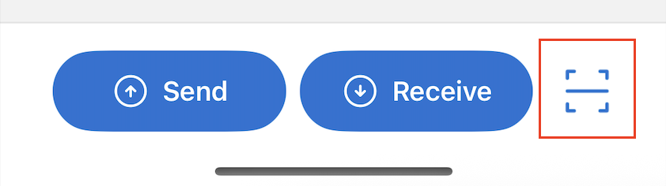
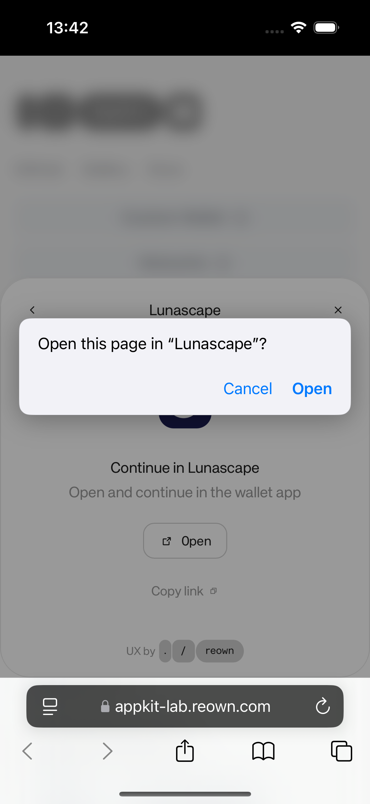
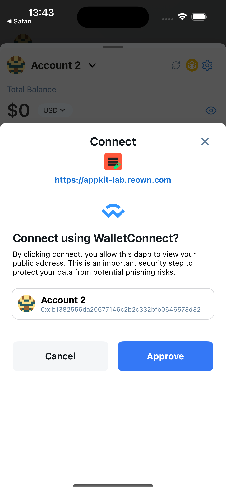
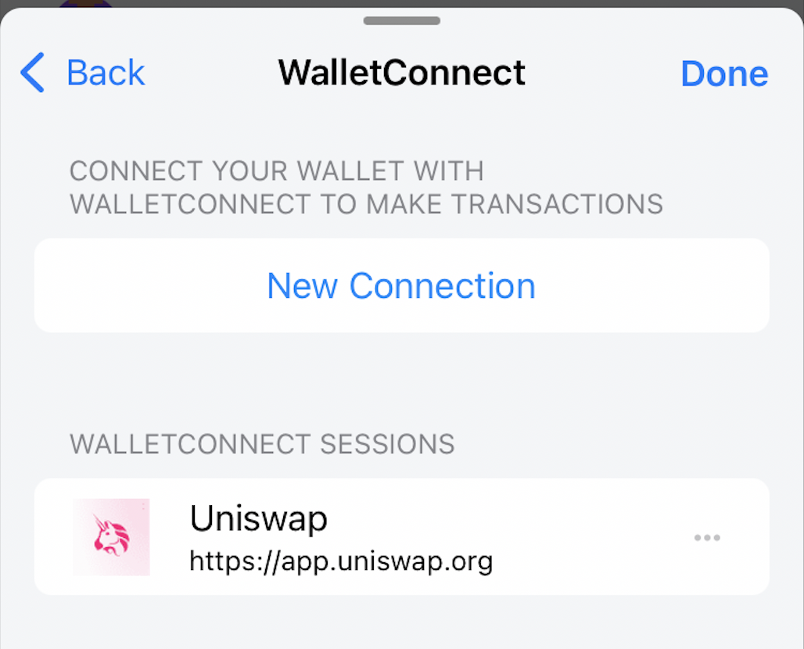
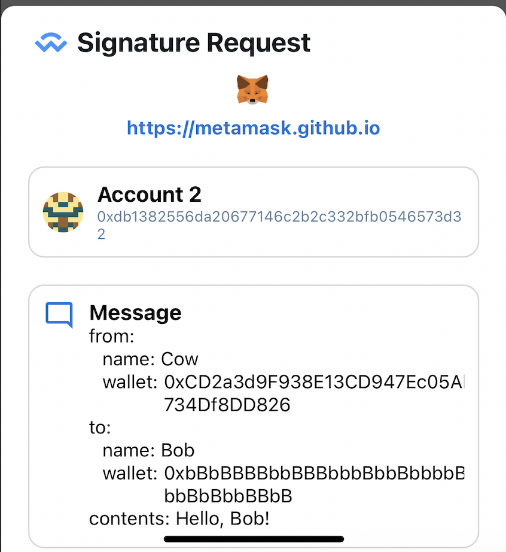
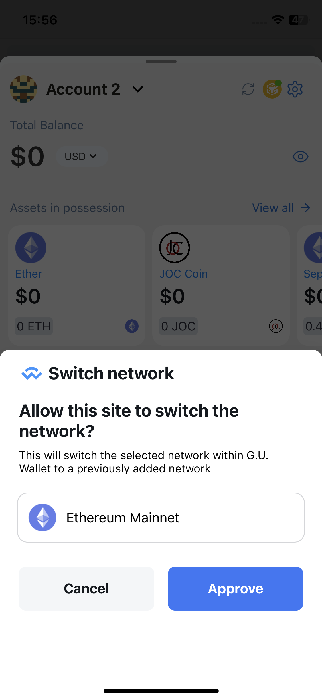

---
navigation:
  order: 600
---

# WalletConnect

WalletConnect is an open protocol that lets a wallet exchange connection, signature, and transaction requests with a DApp through a QR code or deep link. The DApp does not receive your private key, but you must still inspect every request.

For protocol details, see the [WalletConnect website](https://walletconnect.network/).

Lunascape supports WalletConnect connections by QR code and deep link.

> **Important:** A WalletConnect code can contain a request from an untrusted site. Verify the DApp domain, requested account, and network before connecting. Never enter a recovery phrase or private key to complete a WalletConnect connection.

## Connect by QR code

1. On the DApp, choose **WalletConnect**. The DApp displays a QR code.

2. In Lunascape, tap the QR scanner on the Home screen:

   Or on the Wallet Dashboard:

3. Scan the QR code.
4. Verify the DApp name and domain, account, network, and requested permissions.
5. Confirm the connection.

## Connect by deep link

1. In the DApp's wallet list, select **Lunascape**.

2. When prompted to open Lunascape, tap **Open**.

3. In Lunascape, verify the request and confirm the connection.

## WalletConnect Sessions

A successful connection creates a session. Open **Wallet** > **Settings** > **WalletConnect** to review active sessions.

Delete a session to disconnect the DApp. Disconnecting from the DApp also removes its session from Lunascape.

> **Tip:** Remove sessions you no longer use or do not recognize.

## Sign a message

Lunascape can display requests using these signature methods:

- Personal Sign

- Sign Typed Data

- Sign Typed Data V3

- Sign Typed Data V4

> **Warning:** A signature can authorize account access or token actions. Reject an unexpected request or a message you cannot understand.

## Confirm a transaction

When a connected DApp requests a transaction, Lunascape displays a confirmation. Verify the network, destination or contract, amount, token permissions, and fee before approving it.

> **Important:** A confirmed blockchain transaction usually cannot be canceled or reversed.

## Switch Network

When a DApp requests a different network, Lunascape shows the requested network for confirmation. Reject the request if it does not match the task you intended to perform.

